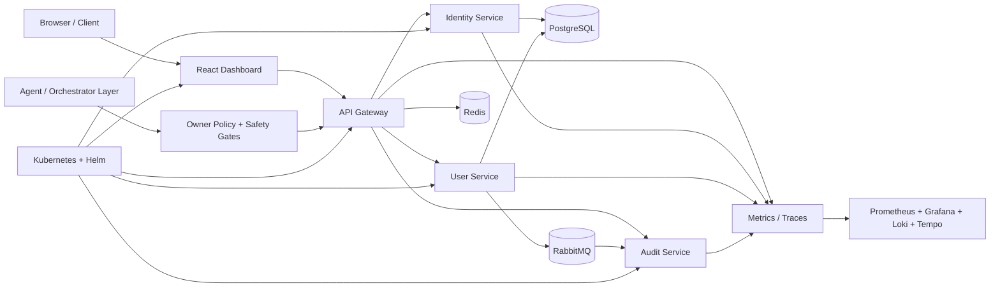

# ⚡ Aetheris Platform

### Build. Secure. Observe. Orchestrate.

**A long-term platform engineering and local-AI foundation focused on secure services, agent governance, deterministic verification and owner-controlled automation.**

`Java 21` • `Spring Boot` • `React` • `PostgreSQL` • `Redis` • `RabbitMQ` • `Prometheus` • `Grafana` • `OpenTelemetry` • `Kubernetes` • `Helm` • `Python verification tooling`

---

## 🎯 What Aetheris demonstrates

Aetheris is an engineering portfolio and experimentation platform that grows one capability at a time instead of collecting disconnected demos. The repository includes API platform work, identity and authorization, distributed data services, observability, resilience, deployment automation, AI-agent governance, safety policy, deterministic release evidence and pre-PC readiness controls.

> **Portfolio goal:** every important capability should be explainable in an interview, visible in code, and backed by reproducible evidence rather than unsupported claims.

---

## ✅ Current repository milestone — Stage 27

The canonical development line has completed **Stage 27 — Canonical Branch Governance & Release Promotion Gate**. It builds on Stage 26 safety/evidence certification, Stage 25 first-boot readiness and Stage 24 reproducible-build hardening.

Current repository status: **`PRE_PC_HARDENED`**.

Current physical-machine status: **`BLOCKED_PENDING_HARDWARE`**.

**Physical-PC validation remains pending.** Hosted CI and repository evidence do not prove that WSL2, Docker Desktop, GPU acceleration, local-model performance, thermals, or the complete local stack work on the owner's future physical machine.

### Stage 27 repository result

The repository now uses only the intended long-lived branch model:

- **`main`** — stable/release history.
- **`feature/syntra-aetheris-foundation-v2`** — the single canonical active development line.

Stage 27 adds deterministic governance that rejects legacy stage/integration branch references in CI and rejects release-promotion context to `main` from a non-canonical development branch. GitHub administrative branch protection/rulesets remain a separate repository setting and are not falsely claimed by this CI gate.

### Stage 26 safety foundation

Stage 26 continues to verify safety and truth boundaries such as:

- ZERO_COST and PRIVATE-mode restrictions;
- explicit approval for high-impact operations;
- fail-closed owner deny rules;
- high-risk workspace command execution policy;
- proposal-oriented GitHub write behavior;
- dry-run rejection of dangerous intent;
- read-only incident replay;
- isolated chaos rehearsal;
- disabled live-money, withdrawal and transfer boundaries in pre-production workstation packages;
- protection against hosted CI being presented as physical-PC validation.

---

## 🌿 Development-line policy

All new PC-independent Syntra/Aetheris work continues on:

`feature/syntra-aetheris-foundation-v2`

Only reviewed promotion work should move toward `main`. Temporary per-stage branches are not valid development bases anymore.

---

## 🏗️ Architecture

### Core engineering domains

| Domain | What Aetheris implements |
|---|---|
| API platform | Gateway routing, protected endpoints, structured failures |
| Identity | JWT access tokens, refresh-token rotation, RBAC and scopes |
| Data | PostgreSQL persistence with shared service data |
| Distributed systems | Redis caching/rate limiting and RabbitMQ events |
| Resilience | Circuit breakers, retries, timeouts and fallbacks |
| Observability | Metrics, logs and distributed traces |
| Cloud native | Docker Compose, Kubernetes, Helm and health probes |
| AI/agents | Mission planning, safe tool registry, policy evaluation and orchestrator foundations |
| Safety | Approval gates, dry-run controls, incident replay and regression certification |
| Release integrity | Dependency lockdown, reproducible builds, contract freeze and deterministic evidence |
| Repository governance | Canonical development-line enforcement and release-promotion checks |

---

## 🔐 Security and owner-control model

Access tokens use signed JWTs containing identity, role and effective-scope claims. Refresh tokens are opaque, rotated on use, revocable and stored as hashes.

The agent/orchestrator side adds owner-policy evaluation before high-impact operations. Repository safeguards keep critical pre-PC boundaries fail-closed: no production activation, no live-money execution, no withdrawals, no transfers, no unrestricted shell capability, and no administrative bypass is considered validated by hosted CI.

---

## 📈 Observability and resilience

The platform contains Prometheus/Grafana/Loki/Tempo/OpenTelemetry integration, structured health checks and resilience patterns such as timeouts, retries for safe reads, circuit breakers and controlled fallbacks.

These are repository capabilities and testable deployment definitions. Runtime performance on the owner's physical hardware is intentionally left unclaimed until physical validation exists.

---

## 🚀 Development quick start

Repository definitions include Docker Compose, Helm and service-level development workflows. Use the first-boot and validation runbooks before treating any local environment as validated:

- [`docs/first-boot-runbook.md`](docs/first-boot-runbook.md)
- [`docs/stage-25-first-boot-readiness.md`](docs/stage-25-first-boot-readiness.md)
- [`docs/stage-26-safety-certification.md`](docs/stage-26-safety-certification.md)
- [`docs/stage-27-repository-governance.md`](docs/stage-27-repository-governance.md)

The exact commands that are appropriate depend on the machine and the validation stage. The project intentionally does not claim successful owner-PC execution before that machine is available and tested.

---

## 🗺️ Engineering progression

Aetheris has progressed beyond its original Stage 1–7 platform foundation into agent governance, release hardening and repository governance. The current verified repository milestone is **Stage 27**.

Recent hardening milestones include:

- **Stage 21** — physical-target pilot contract and owner-policy boundaries;
- **Stage 22** — release hardening, schema/security evidence and merge readiness;
- **Stage 23** — frozen compatibility contract;
- **Stage 24** — dependency lockdown and reproducible-build verification;
- **Stage 25** — deterministic first-boot readiness bundle and physical-PC truth boundary;
- **Stage 26** — deterministic safety certification plus evidence-integrity controls;
- **Stage 27** — canonical branch governance and release-promotion gate.

Physical execution milestones remain blocked until suitable owner hardware exists.

---

## 📚 Documentation

- [Architecture](docs/architecture.md)
- [Interview talking points](docs/interview-guide.md)
- [Token flow and threat model](docs/security/token-flow.md)
- [Resilience runbook](docs/resilience.md)
- [Kubernetes + Helm runbook](docs/kubernetes.md)
- [First-boot runbook](docs/first-boot-runbook.md)
- [Stage 25 first-boot readiness](docs/stage-25-first-boot-readiness.md)
- [Stage 26 safety certification](docs/stage-26-safety-certification.md)
- [Stage 27 repository governance](docs/stage-27-repository-governance.md)

---

## 💡 Design rule

The development stack is designed around **no mandatory recurring AI or platform subscription fee**. Open-source and locally controllable components are the default; external/cloud services remain optional and policy-governed.

---

### From platform fundamentals to policy-governed local AI infrastructure.

**Built by Poojana Kaveesh Sellahewa**

