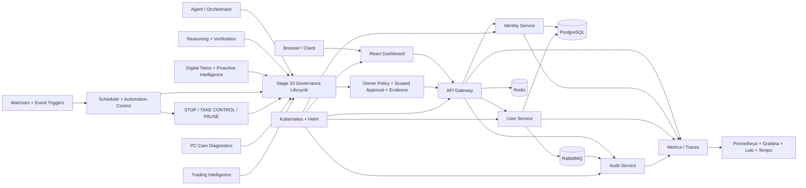

<div align="center">

# ⚡ Aetheris Platform

### Build. Secure. Observe. Orchestrate. Govern. Verify.

**A long-term platform engineering and local-AI foundation for owner-controlled automation, deterministic verification, cross-system governance, recovery, digital twins, reasoning and safety-critical experimentation.**


`Java 21` • `Spring Boot` • `React` • `PostgreSQL` • `Redis` • `RabbitMQ` • `Prometheus` • `Grafana` • `OpenTelemetry` • `Kubernetes` • `Helm` • `Python verification tooling`

</div>

---

## 🎯 What Aetheris demonstrates

Aetheris is an engineering portfolio and experimentation platform that grows one capability at a time instead of collecting disconnected demos. The repository combines API/identity foundations, distributed data services, observability, resilience, deployment automation, agent orchestration, structured owner policy, scoped approvals, deterministic release evidence, PC/system-engineering controls, fail-closed trading intelligence, advanced reasoning, digital twins, proactive control, emergency-aware automation and cross-system governance.

> **Portfolio rule:** important capabilities should be visible in code, explainable in an interview and backed by reproducible evidence rather than unsupported claims.

---

## ✅ Repository roadmap — Stage 34 / 34

The canonical development line has reached the final repository-side roadmap stage: **Stage 34 — Master Build Prompt / Canonical Build Specification**.

**Repository status:** `PRE_PC_HARDENED + ROADMAP_34_COMPLETE`  
**Physical-machine status:** `BLOCKED_PENDING_HARDWARE`

Stage 34 turns the Syntra × Aetheris Master Blueprint v2.0 into a repository-native constitution at [`docs/master-build-spec.md`](docs/master-build-spec.md). It records product identity, architectural boundaries, the universal governance lifecycle, owner-rule source of truth, Zero-Cost/Private/emergency invariants, build order, validation gates, current evidence, physical-PC truth boundaries and the final continuation prompt.

A deterministic validator at `tools/validate_master_build_spec.py` and the Stage 34 workflow prevent the final roadmap status from silently drifting into unsupported claims.

### What 34 / 34 does **not** mean

Hosted CI and repository evidence do **not** prove that WSL2, Docker Desktop, GPU acceleration, local-model performance, thermals, storage health, voice hardware, browser/phone control, external notification delivery or the complete local stack work on the owner's future physical machine.

The repository still does not treat unrestricted privileged host execution, production activation, autonomous destructive PC repair, live-money execution, withdrawals or transfers as validated default authority.

---

## 🏗️ Architecture



### Core engineering domains

| Domain | Repository evidence |
|---|---|
| API & identity | gateway routing, protected endpoints, JWT/refresh-token foundations, RBAC/scopes |
| Distributed systems | PostgreSQL, Redis, RabbitMQ, resilience patterns |
| Observability | metrics, logs, traces, automation timeline and audit exploration |
| Cloud native | Docker Compose, Kubernetes, Helm and health probes |
| Agent orchestration | mission planning, safe tool registry, policy evaluation foundations |
| Reasoning | confidence/uncertainty, verifier/critic, simulation, source trust, decision ledger |
| Digital twins | project/PC/workspace state, proactive detection, priority and recovery planning |
| Automation control | workflow/event normalization, scheduling, focus policy and emergency preemption |
| Governance | ordered lifecycle, risk escalation, canonical owner rules, scoped approval and completion truth |
| Release integrity | compatibility freeze, dependency lockdown, deterministic evidence and reproducible builds |
| PC care | deterministic diagnosis/recommendation planning before physical validation |
| Trading | fail-closed proposal/risk foundation with live-money disabled by default |

---

## 🧠 Universal action lifecycle

```text
UNDERSTAND
  → PLAN
  → CHECK RULES
  → ASSESS RISK
  → SIMULATE / PREVIEW when required
  → APPROVE when required
  → EXECUTE
  → VERIFY
  → RECORD
  → LEARN
  → REPORT
```

A preflight `ALLOW` means **eligible to execute**. It is not proof that execution happened. If execution is not observed, the `EXECUTE` phase is not complete. Final success requires verification evidence or an explicit `UNVERIFIED` result.

Models may recommend actions, but they do not outrank deterministic owner policy, emergency control, Zero-Cost/Private-mode boundaries or verification requirements.

---

## 🔐 Owner-control and safety invariants

- persisted owner rules remain the canonical owner-rule source of truth;
- `ZERO-COST` hard-blocks billable/non-zero external-cost paths;
- `PRIVATE` keeps configured protected content on approved local paths unless exact policy/owner override permits otherwise;
- emergency precedence is `STOP > TAKE_CONTROL > PAUSE > NORMAL`;
- public, financial, destructive, privileged and difficult-to-undo work receives stricter control;
- live-money trading remains outside the default trusted path;
- secrets must not be committed, logged or exposed through prompts/evidence;
- physical-machine capability cannot be inferred from hosted CI;
- GitHub branch protection/rulesets remain separate repository-administration controls.

---

## 🧪 Verification and CI

The canonical development line uses pinned GitHub Actions and deterministic validation where practical. Current gates include:

- Java service/orchestrator tests;
- workstation-agent packaging and safety checks;
- dashboard frozen dependency install/build;
- release hardening and deterministic evidence;
- compatibility-contract freeze;
- dependency lockdown and reproducible-build comparison;
- Stage 25–29 validation;
- Stage 30 reasoning regression;
- Stage 31 digital-twin/recovery regression;
- Stage 32 automation/emergency-control regression;
- Stage 33 governance regression;
- Stage 34 master-build-spec integrity validation;
- CodeQL for Java and JavaScript/TypeScript.

CI success is repository evidence, not physical-PC validation.

### Stage 34 validation

```bash
python tools/validate_master_build_spec.py
```

### Later-stage regressions

```bash
cd aetheris-reasoning
python -m unittest discover -s tests -v

mvn -B -f orchestrator-service/pom.xml -Dtest=Stage31FoundationTest test
mvn -B -f orchestrator-service/pom.xml -Dtest=Stage32FoundationTest test
mvn -B -f orchestrator-service/pom.xml -Dtest=Stage33GovernanceTest test
```

---

## 🌿 Repository governance

Long-lived branch intent:

- `main` — stable/release history;
- `feature/syntra-aetheris-foundation-v2` — canonical active development line.

Temporary stage branches are review branches, not future canonical bases. GitHub-hosted branch protection/rulesets remain an account/repository administration task and are not replaced by application code.

---

## 🗺️ Roadmap state

Recent hardening and AI-control stages include:

- **Stage 21** — physical-target pilot contract and owner-policy boundaries;
- **Stage 22** — release hardening and deterministic evidence;
- **Stage 23** — frozen compatibility contract;
- **Stage 24** — dependency lockdown and reproducible-build verification;
- **Stage 25** — first-boot readiness and physical-PC truth boundary;
- **Stage 26** — safety certification and evidence-integrity controls;
- **Stage 27** — canonical repository governance and promotion gate;
- **Stage 28** — PC-care diagnostics and safe remediation planning;
- **Stage 29** — fail-closed trading intelligence/risk foundation;
- **Stage 30** — advanced reasoning and verification;
- **Stage 31** — digital twins, proactive intelligence and bounded self-healing;
- **Stage 32** — automation, observability and deterministic emergency control;
- **Stage 33** — cross-system governance, scoped approvals and completion truth;
- **Stage 34** — canonical master build/continuation specification.

**Master repository roadmap: 34 / 34 complete.**

The next engineering phase is not “Stage 35.” It is evidence-driven execution of the existing specification: physical-PC first boot, Windows/WSL2/Docker/GPU validation, local model/voice benchmarks, UI performance testing, safe tool execution and integration validation on real owner hardware.

---

## 📚 Key documentation

- [Canonical master build specification](docs/master-build-spec.md)
- [Master roadmap](docs/master-roadmap.md)
- [Architecture](docs/architecture.md)
- [Interview talking points](docs/interview-guide.md)
- [Token flow and threat model](docs/security/token-flow.md)
- [Resilience runbook](docs/resilience.md)
- [First-boot runbook](docs/first-boot-runbook.md)
- [Stage 25 first-boot readiness](docs/stage-25-first-boot-readiness.md)
- [Stage 26 safety certification](docs/stage-26-safety-certification.md)
- [Stage 27 repository governance](docs/stage-27-repository-governance.md)
- [Stage 28 PC care & system engineering](docs/stage-28-pc-care-system-engineering.md)
- [Stage 29 trading intelligence & execution](docs/stage-29-trading-intelligence-execution.md)
- [Stage 30 reasoning & verification](docs/stage-30-reasoning.md)
- [Stage 31 digital twins & bounded self-healing](docs/stage-31-digital-twins-self-healing.md)
- [Stage 32 automation, observability & emergency control](docs/stage-32-automation-observability-emergency-control.md)
- [Stage 33 governance & approvals](docs/stage-33-governance-approvals.md)
- [GitHub branch-protection target](docs/github-branch-protection.md)

---

## 💡 Design rule

The platform is designed around **no mandatory recurring AI or platform subscription fee**. Open-source and locally controllable components are preferred; external/cloud services remain optional and policy-governed.

<div align="center">

### One coherent assistant experience, backed by modular and verifiable infrastructure.

**Built by Poojana Kaveesh Sellahewa**

</div>
