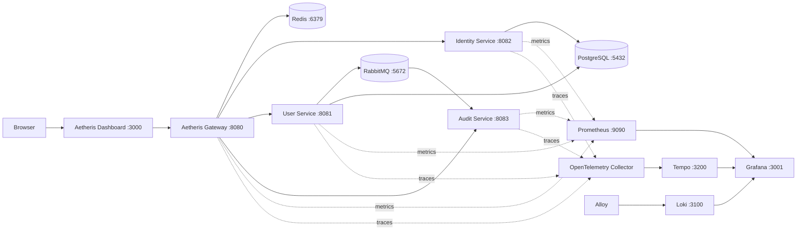

# Aetheris Platform

**Build. Secure. Observe. Orchestrate.**

Aetheris is an open-source distributed API, identity, observability, and AI-agent platform built with Java, Spring Boot, React, PostgreSQL, Redis, RabbitMQ, Prometheus, Grafana, Loki, Tempo, OpenTelemetry, and cloud-native technologies.


## Current milestone — Stage 6 complete

Stage 6 adds gateway-level resilience using Resilience4j circuit breakers, downstream connect and response timeouts, a time limiter, idempotent read retries with exponential backoff, and structured HTTP 503 fallbacks. Mutating user requests and identity operations are deliberately not retried automatically to avoid duplicate side effects.

Runtime verification completed on 2026-09-11: authenticated `/api/users` reads returned 200 in the healthy state, stopping `user-service` produced structured 503 fallback responses, `userReadCircuit` was observable in HALF_OPEN state through the actuator endpoint, and restarting only `user-service` restored successful reads without restarting the gateway.



## Quick start

Prerequisite: Docker Desktop or Docker Engine with Compose.

```bash
git clone https://github.com/teldigi5-wq/aetheris-platform.git
cd aetheris-platform
docker compose up --build
```

For the full observability stack:

```bash
docker compose --profile observability up --build
```

Main endpoints:

- Dashboard: `http://localhost:3000`
- Gateway health: `http://localhost:8080/actuator/health`
- Identity API: `http://localhost:8080/api/auth/*`
- Protected User API: `http://localhost:8080/api/users`
- Protected Event API: `http://localhost:8080/api/events`
- Redis: `localhost:6379`
- RabbitMQ Management UI: `http://localhost:15672`
- Prometheus: `http://localhost:9090`
- Grafana: `http://localhost:3001` (`aetheris` / `aetheris` locally)
- Loki: `http://localhost:3100`
- Tempo: `http://localhost:3200`
- Grafana Alloy: `http://localhost:12345`

## Security model

Access tokens are signed JWTs containing identity, role, and effective scope claims. Refresh tokens are opaque, rotated on use, revocable, and stored only as SHA-256 hashes in PostgreSQL. The gateway validates access tokens and enforces scopes before forwarding protected requests.

Default role scopes:

- `API_CONSUMER`: `users:read`, `services:read`
- `DEVELOPER`: `users:read`, `users:write`, `services:read`, `identity:read`
- `ADMIN`: all developer scopes plus `identity:write`

## Distributed traffic model

Redis provides a shared cache for user reads and distributed token-bucket rate limiting. User cache entries use a 60-second TTL and are evicted on writes. RabbitMQ carries asynchronous `user.created` and `user.deleted` events to the audit service through the durable `aetheris.events` topic exchange.

## Observability model

Each Java service exposes `/actuator/prometheus`. Prometheus scrapes gateway, user, identity, and audit metrics every five seconds. Grafana is provisioned with Prometheus, Loki, and Tempo datasources plus an Aetheris overview dashboard.

OpenTelemetry tracing is sampled at 100% in the local development profile for easier learning and debugging. Services export OTLP traces to the OpenTelemetry Collector, which forwards them to Tempo. Grafana Alloy discovers Docker containers and forwards their logs to Loki, giving the local platform centralized logs without changing application logging code.

The observability containers are grouped under the `observability` Compose profile because the full metrics/logs/traces stack is heavier than the core platform and should not be mandatory on an 8 GB development machine.

## Resilience model

The gateway protects downstream service calls with Resilience4j circuit breakers and explicit network timeouts. Safe read requests can be retried with exponential backoff, while mutating user operations and identity operations are not replayed automatically. When a downstream dependency is unavailable, Aetheris returns a structured 503 fallback instead of leaking raw connection failures. Circuit breaker state is exposed through actuator endpoints for debugging and observability.

## Engineering goals

Aetheris is built around real platform-engineering concepts: API management, identity, security, distributed communication, caching, traffic management, messaging, observability, resilience, cloud-native deployment, developer tooling, and agent governance. Each stage remains small enough to explain in an interview while contributing to one coherent platform.

## Roadmap

- [x] Stage 1 — Gateway + user microservice + PostgreSQL
- [x] Stage 1.5 — Dashboard, DTO/service layers, OpenAPI, structured errors, stronger CI
- [x] Stage 2 — Identity service, JWT authentication, RBAC, refresh tokens, scoped permissions
- [x] Stage 3 — Redis caching and distributed rate limiting
- [x] Stage 4 — RabbitMQ event messaging
- [x] Stage 5 — Prometheus, Grafana, centralized logs, OpenTelemetry
- [x] Stage 6 — Circuit breakers, retries, timeouts, load balancing
- [ ] Stage 7 — Local Kubernetes + Helm
- [ ] Stage 8 — Aetheris CLI + SDK generation
- [ ] Stage 9 — AI Agent Gateway, policy engine, local Ollama integration
- [ ] Stage 10 — Chaos Lab + Security Lab

## Zero-cost design rule

The development stack has no mandatory recurring software fee. Local Docker infrastructure and open-source components are the default. Cloud deployment is optional, not required to run or demonstrate the platform.

## Documentation

- [Architecture](docs/architecture.md)
- [Interview talking points](docs/interview-guide.md)
- [Token flow and threat model](docs/security/token-flow.md)
- [Resilience runbook](docs/resilience.md)

## Author

Built by **Poojana Kaveesh Sellahewa** as a long-term software engineering and distributed-systems portfolio project.
