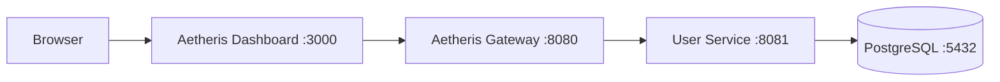

# Aetheris Platform

**Build. Secure. Observe. Orchestrate.**

Aetheris is an open-source distributed API, identity, observability, and AI-agent platform built with Java, Spring Boot, React, PostgreSQL, and cloud-native technologies.


## Current milestone — Stage 1.5

Aetheris now contains a real API gateway, independently deployable user service, PostgreSQL persistence, typed service/DTO layers, consistent API errors, OpenAPI documentation, a React operations dashboard, health endpoints, Docker Compose, and CI builds.



## Quick start

Prerequisite: Docker Desktop or Docker Engine with Compose.

```bash
git clone https://github.com/teldigi5-wq/aetheris-platform.git
cd aetheris-platform
docker compose up --build
```

Then open:

- Dashboard: `http://localhost:3000`
- Gateway health: `http://localhost:8080/actuator/health`
- User API: `http://localhost:8080/api/users`
- User-service Swagger UI: `http://localhost:8081/swagger-ui.html`
- OpenAPI JSON: `http://localhost:8081/v3/api-docs`

## API example

```bash
curl -X POST http://localhost:8080/api/users \
  -H "Content-Type: application/json" \
  -d '{"name":"Ada Lovelace","email":"ada@example.com"}'
```

## Engineering goals

Aetheris is intentionally being built around problems that appear in real platform engineering interviews: API management, identity, security, distributed communication, resilience, observability, cloud-native deployment, and agent governance. Each stage adds a small number of concepts so the architecture remains explainable rather than becoming a collection of unrelated technologies.

## Roadmap

- [x] Stage 1 — Gateway + user microservice + PostgreSQL
- [x] Stage 1.5 — Dashboard, DTO/service layers, OpenAPI, structured errors, stronger CI
- [ ] Stage 2 — Identity service, JWT authentication, RBAC, refresh tokens
- [ ] Stage 3 — Redis caching and distributed rate limiting
- [ ] Stage 4 — RabbitMQ/Kafka event messaging
- [ ] Stage 5 — Prometheus, Grafana, centralized logs, OpenTelemetry
- [ ] Stage 6 — Circuit breakers, retries, timeouts, load balancing
- [ ] Stage 7 — Local Kubernetes + Helm
- [ ] Stage 8 — Aetheris CLI + SDK generation
- [ ] Stage 9 — AI Agent Gateway, policy engine, local Ollama integration
- [ ] Stage 10 — Chaos Lab + Security Lab

## Zero-cost design rule

The development stack has no mandatory recurring software fee. Local Docker infrastructure and open-source components are the default. Cloud deployment is optional, not required to run or demonstrate the platform.

## Documentation

- [Architecture](docs/architecture.md)
- [Interview talking points](docs/interview-guide.md)

## Author

Built by **Poojana Kaveesh Sellahewa** as a long-term software engineering and distributed-systems portfolio project.
