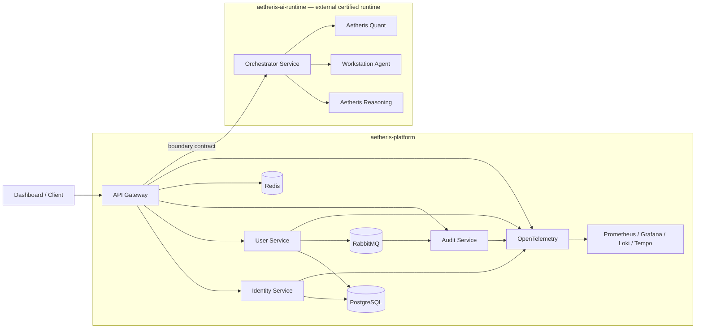

<div align="center">

# Aetheris Platform

### Cloud-native distributed systems engineering with an external AI runtime integration

**A portfolio project centered on secure backend services, distributed systems, observability, resilience and Kubernetes — with Syntra/Aetheris automation research separated into an independently certified runtime repository.**


`Java 21` • `Spring Boot` • `PostgreSQL` • `Redis` • `RabbitMQ` • `Resilience4j` • `OpenTelemetry` • `Prometheus` • `Grafana` • `Loki` • `Tempo` • `Kubernetes` • `Helm` • `React + TypeScript`

</div>

---

## Portfolio pitch

The strongest way to evaluate Aetheris is as a **platform-engineering project first**.

The core system demonstrates a coherent progression through:

1. API gateway and service boundaries;
2. identity, JWT access tokens and refresh-token lifecycle;
3. PostgreSQL persistence, Redis caching and traffic controls;
4. asynchronous RabbitMQ events and audit processing;
5. metrics, logs and traces with OpenTelemetry and the Grafana stack;
6. bounded resilience with safe retry behavior;
7. Docker, Kubernetes and Helm deployment foundations.

Those areas are the **primary recruiter/interview story** because they are concrete, independently understandable and directly visible in code and deployment assets.

The later Syntra/Aetheris orchestration, reasoning, workstation and quantitative runtime source has been extracted to the separate [`teldigi5-wq/aetheris-ai-runtime`](https://github.com/teldigi5-wq/aetheris-ai-runtime) repository. This repository retains the platform-side contracts, integration path, certification references and evidence needed to consume that runtime without duplicating its source.

See **[Portfolio scope & maturity](docs/portfolio-scope.md)** for the exact separation.

---

## Platform / AI runtime boundary

Aetheris now has an explicit two-repository ownership model.

| Repository | Owns |
|---|---|
| `aetheris-platform` | Gateway, identity, user and audit services; dashboard; observability; deployment assets; platform contracts; cross-repository integration and evidence |
| `aetheris-ai-runtime` | `orchestrator-service`, `workstation-agent`, `aetheris-reasoning`, `aetheris-quant` and their runtime-owned certification assets |

The currently certified runtime checkpoint recorded by the platform is:

`teldigi5-wq/aetheris-ai-runtime@6c714d1772db2db490cd035e11a78308f26f8a63`

That SHA is a **certification reference**, not a claim that the runtime repository can never advance. Platform integration should move to a newer runtime only through the same evidence-driven certification process.

Boundary assets include:

- `contracts/ai-runtime-boundary.v1.json` — cross-repository contract;
- `architecture/ai-runtime-certification-reference.json` — certified runtime reference and truth boundaries;
- `architecture/ai-runtime-extraction-manifest.json` — extraction ownership record;
- `docker-compose.integration-external.yml` — external-runtime integration path;
- `tools/load_certified_ai_runtime.sh` — certified-runtime loading helper.

The extracted runtime-owned source roots must not be reintroduced into this repository as duplicate implementations.

---

## What to review first

| If you have... | Start here |
|---|---|
| **2 minutes** | This README → **Core platform track** → architecture diagram |
| **10 minutes** | [Demo guide](docs/demo-guide.md) → gateway/auth → messaging → observability |
| **Interview prep** | [Interview guide](docs/interview-guide.md) → [Architecture decisions](docs/architecture-decisions.md) |
| **AI/operator interest** | [Portfolio scope & maturity](docs/portfolio-scope.md) → [Architecture](docs/architecture.md) |
| **Repository governance interest** | [Verification checklist](docs/verification-checklist.md) → [Master roadmap](docs/master-roadmap.md) |

---

## Core platform track — primary portfolio story

### 1. Gateway and service boundaries

A Spring Cloud Gateway provides one ingress surface in front of independently bounded services. The platform repository separates identity, user-domain and audit/event responsibilities. Requests for AI orchestration cross a defined repository boundary into the external Aetheris AI runtime.

### 2. Identity and token lifecycle

The identity service implements registration, login, refresh and logout flows around JWT access tokens and refresh-token state. Refresh tokens are treated as credentials: rotation/revocation and stored token hashes are part of the design rather than storing reusable plaintext refresh credentials.

### 3. Persistence, cache and traffic controls

PostgreSQL provides durable relational state. Redis supports low-latency distributed concerns such as caching/rate-related controls. Security-sensitive behavior is designed to fail closed rather than silently weakening authorization when an infrastructure dependency is unhealthy.

### 4. Messaging and audit flow

RabbitMQ supports asynchronous event delivery so audit/event processing does not have to block every synchronous user request. This creates an explicit delivery and failure boundary that can be observed and reasoned about.

### 5. Observability

The project includes OpenTelemetry instrumentation foundations plus Prometheus, Grafana, Loki and Tempo for metrics, visualization, logs and traces.

### 6. Resilience

Resilience4j policies demonstrate circuit breaking and bounded retry behavior. Retrying is intentionally constrained to operations where repetition is safe rather than being applied blindly to mutating requests.

### 7. Deployment

Docker Compose provides the fast local integration path. Kubernetes and Helm assets demonstrate health/readiness, replicas, deployment topology and cloud-native operational concepts.

---

## Core architecture



The core platform story remains useful even if the optional AI/operator track is ignored entirely.

---

## External AI/control-plane extensions

The later AI/control-plane work is intentionally presented as a **secondary engineering/research track**. Runtime implementation lives in `aetheris-ai-runtime`; this platform repository owns the integration boundary and evidence that connects it to the core system.

| Extension | Source owner | Current maturity |
|---|---|---|
| Agent/orchestration service | AI runtime | Runtime implemented and repository-tested |
| Deterministic owner policy / scoped approvals | AI runtime + platform boundary evidence | Repository implemented and regression-tested |
| Reasoning / verification components | AI runtime | Repository implemented; not a claim of human-level autonomy |
| Digital-twin / recovery foundations | AI runtime / retained platform contracts | Bounded research foundations |
| Generic browser operator | AI runtime | Repository adapter exists; physical runtime not yet validated |
| LinkedIn/Vercel site skills | AI runtime research assets | Templates only; exact site flows not physically validated |
| PC-care / workstation integration | AI runtime | `BLOCKED_PENDING_HARDWARE` |
| Trading intelligence | AI runtime | Fail-closed research/risk foundation; live-money authority disabled |

The architectural rule is simple: **models may propose actions, but they are not the final policy authority**. Automation remains subject to deterministic policy, approval and verification rules.

---

## Quick start

### Prerequisites

- Git
- Docker with Docker Compose v2

Java 21, Node and Python are needed only when running individual modules or repository validators directly.

### Start the core platform stack

```bash
git clone https://github.com/teldigi5-wq/aetheris-platform.git
cd aetheris-platform
docker compose up --build
```

Core local surfaces:

| Surface | Local address |
|---|---|
| Dashboard | `http://localhost:3000` |
| API Gateway | `http://localhost:8080` |
| User Service | `http://localhost:8081` |
| Identity Service | `http://localhost:8082` |
| Audit Service | `http://localhost:8083` |
| RabbitMQ management | `http://localhost:15672` |

The Orchestrator surface on `http://localhost:8090` belongs to the **external `aetheris-ai-runtime` integration**, not to a runtime source tree in this repository. Use the certified external-runtime integration assets when that surface is required.

Compose credentials and fallback secrets are **development-only defaults**.

### Start observability

```bash
docker compose --profile observability up --build
```

Additional surfaces include Grafana on `http://localhost:3001`, Prometheus on `http://localhost:9090`, Tempo on `http://localhost:3200` and Loki on `http://localhost:3100`.

See **[docs/demo-guide.md](docs/demo-guide.md)** for the recommended reviewer sequence.

---

## Security and reliability highlights

- access/refresh token lifecycle is treated as a credential-management problem, not just JWT generation;
- persistence entities are not used as public API contracts by default;
- Redis/RabbitMQ failures are explicit infrastructure failures, not reasons to weaken authorization;
- retries are limited to operations where repetition is safe;
- secrets should never be committed, logged or included in evidence artifacts;
- stable `main` is protected and changes are promoted through pull requests and CI;
- dependency lockdown, CodeQL and reproducibility checks provide repository-level evidence.

For the detailed security model, see **[Token flow and threat model](docs/security/token-flow.md)**.

---

## Kubernetes / Helm and operational story

The deployment track is intended to demonstrate more than “I wrote a Dockerfile.” Reviewers can inspect Kubernetes/Helm deployment assets, health/readiness behavior, replica configuration and scaling concepts, observability integration, and recovery behavior when services become unavailable.

See **[Architecture](docs/architecture.md)** and **[Demo guide](docs/demo-guide.md)**.

---

## AI/operator track: explicit truth boundary

The Syntra/Aetheris runtime has repository evidence, but some claims depend on hardware and authenticated external services that have not yet been physically tested on the target PC.

**Physical-machine status:** `BLOCKED_PENDING_HARDWARE`  
**Physical-PC validation remains pending.** Hosted CI and repository evidence are not substitutes for validation on the owner's target machine.

The project therefore does **not** claim that WSL2, Docker Desktop, GPU acceleration, local-model latency, thermals, voice hardware, Chrome/Edge WebDriver sessions, LinkedIn automation or Vercel browser automation are validated on the future owner PC.

It also makes **no production-activation, registry-publication or live-money execution claim** from repository/hosted-CI evidence alone.

---

## Roadmap history and why Stage 34 / 34 still appears

The repository contains two historical tracks:

1. the original cloud-native platform progression, which is the primary portfolio narrative;
2. the later Syntra × Aetheris master roadmap, which expanded the project into AI orchestration, governance and pre-PC automation research before runtime ownership was extracted into its own repository.

The later repository roadmap reached **Stage 34 / 34**. That statement is retained for historical/validation-contract consistency; it is **not** the headline claim for the portfolio and it does not mean every aspirational subsystem is production-ready.

There is no Stage 35. New work after that roadmap is treated as normal engineering passes or versioned capabilities, not as an attempt to inflate the stage count.

For the full historical record see **[docs/master-roadmap.md](docs/master-roadmap.md)**.

---

## Verification and stable history

Stable `main` is protected by the repository ruleset **`Protect stable main`**.

The Stage 27 governance contract still records `feature/syntra-aetheris-foundation-v2` as the canonical development-line marker used by its historical/repository-governance verification. The completed runtime extraction and stable-main promotion do not rewrite that certification contract.

The verification surface includes backend tests, dashboard builds, compatibility-contract freeze, CodeQL for Java and JavaScript/TypeScript, dependency lockdown, reproducibility checks, platform evidence certification and cross-repository runtime-integration proofs.

Runtime-owned regression/safety certification executes in `aetheris-ai-runtime`; the platform retains the certified reference and the integration/evidence checks needed to consume it. Historical Stage 26 safety/evidence and Stage 27 repository-governance contracts remain CI guards, not the primary recruiter narrative.

Hosted CI is repository evidence, **not physical-PC validation**.

---

## Repository map

```text
aetheris-platform/
├── gateway/                              API ingress and gateway boundary concerns
├── identity-service/                     Authentication and token lifecycle
├── user-service/                         User-domain service and persistence
├── audit-service/                        Audit/event consumption surface
├── dashboard/                            React + TypeScript operator UI
├── observability/                        Prometheus/Grafana/Loki/Tempo/OTel config
├── deploy/                               Kubernetes and Helm assets
├── contracts/                            Cross-service and external-runtime contracts
├── architecture/                         Runtime extraction/certification references
├── docker-compose.integration-external.yml  Certified external-runtime integration
├── tools/load_certified_ai_runtime.sh    Certified-runtime loading helper
├── docs/                                 Architecture, security, runbooks and scope docs
└── build-evidence/                       Repository-side validation evidence/contracts
```

Runtime-owned source directories such as `orchestrator-service/`, `workstation-agent/`, `aetheris-reasoning/` and `aetheris-quant/` intentionally live in the separate AI-runtime repository.

---

## What this project demonstrates in an interview

| Area | Discussion value |
|---|---|
| Backend engineering | API boundaries, DTOs, validation, persistence and failure behavior |
| Security | token lifecycle, authorization assumptions and secret hygiene |
| Distributed systems | gateway topology, Redis, RabbitMQ and asynchronous audit flow |
| Reliability | circuit breaking, safe retry decisions and failure containment |
| Observability | metrics, logs, traces and distributed debugging |
| DevOps | Docker Compose, Kubernetes, Helm and reproducible CI |
| AI systems — optional | cross-repository runtime boundaries, tool/model separation, policy, approvals and verification |
| Engineering communication | ADRs, runbooks, scope/maturity labeling and trade-off reasoning |

The recommended interview approach is to **defend the core platform first** and discuss the AI/operator extensions only when relevant to the role or interviewer.

---

## Documentation

### Reviewer / recruiter path

- [Portfolio scope & maturity](docs/portfolio-scope.md)
- [Demo guide](docs/demo-guide.md)
- [Interview guide](docs/interview-guide.md)
- [Architecture decisions](docs/architecture-decisions.md)
- [Architecture](docs/architecture.md)

### Deep engineering / governance path

- [Master roadmap](docs/master-roadmap.md)
- [Master build specification](docs/master-build-spec.md)
- [Verification checklist](docs/verification-checklist.md)
- [First-boot runbook](docs/first-boot-runbook.md)
- [Versioning and release classes](docs/versioning.md)
- [Release-readiness checklist](docs/release-readiness.md)

---

## Release status

A repository pre-PC candidate named `v0.1.0-pre-pc` has been prepared but not published. The platform is licensed under the **Apache License 2.0**; publication still requires the exact release-candidate verification and truth-boundary checks documented in the release-readiness checklist.

## License

Aetheris Platform is licensed under the **Apache License 2.0**. See [`LICENSE`](LICENSE) for the full terms. Third-party dependencies and incorporated third-party materials remain subject to their respective licenses.

Licensing does not imply physical-PC validation, production activation, registry publication, or live-money execution. The physical-machine status remains `BLOCKED_PENDING_HARDWARE`.

---

## Contributing

Read **[CONTRIBUTING.md](CONTRIBUTING.md)** before changing code, especially identity, policy, workstation, trading or deployment surfaces.

Security-sensitive findings should follow **[SECURITY.md](SECURITY.md)** and should never include secrets in a public issue.

---

<div align="center">

### Build. Secure. Observe. Deploy. Verify.

**Built by Poojana Kaveesh Sellahewa**

</div>