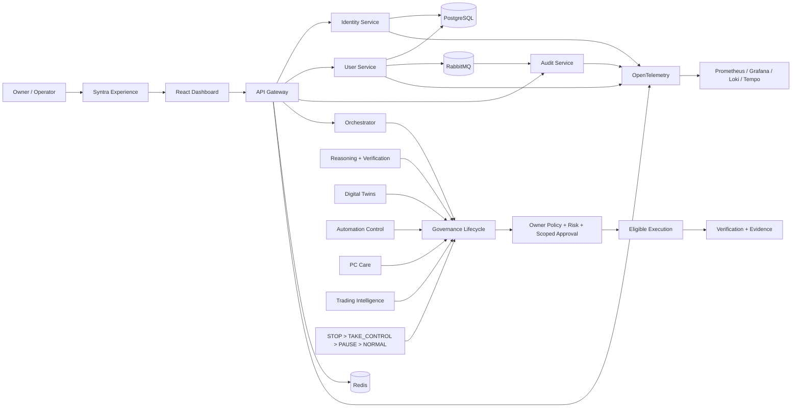

<div align="center">

# Aetheris Platform

### Syntra × Aetheris — owner-controlled AI, distributed systems and verifiable automation

**A portfolio-grade engineering platform that combines cloud-native backend services, local-first AI orchestration, deterministic governance, observability, recovery planning and evidence-driven safety.**


`Java 21` • `Spring Boot` • `React + TypeScript` • `PostgreSQL` • `Redis` • `RabbitMQ` • `OpenTelemetry` • `Prometheus` • `Grafana` • `Kubernetes` • `Helm` • `Python`

</div>

---

## Why Aetheris exists

Aetheris is not a collection of disconnected demos. It is one evolving engineering system designed to show how secure APIs, distributed services, local AI, automation and owner policy can work together without letting an AI model become the final authority.

The project is built around four ideas:

1. **Engineering depth** — real service boundaries, persistence, messaging, resilience, observability, deployment and verification.
2. **Owner control** — deterministic rules, scoped approvals and emergency precedence outrank model suggestions.
3. **Evidence over claims** — important capabilities should be visible in code, explainable in an interview and backed by reproducible checks.
4. **Local-first economics** — no mandatory recurring AI or platform subscription is required by the architecture; external services are optional and policy-governed.

> **Truth boundary:** the repository roadmap is complete, but hosted CI is not proof that the complete stack has been validated on the owner's future physical PC.

---

## Syntra vs Aetheris

| Layer | Role |
|---|---|
| **Syntra** | The owner-facing assistant experience: planning, conversation, voice/UI interaction and coordinated task intent. |
| **Aetheris** | The infrastructure and control plane: APIs, identity, agents, tools, policy, approvals, evidence, automation, observability and recovery. |
| **Models** | Replaceable reasoning workers. They may recommend actions but do not outrank deterministic owner policy. |

This separation keeps the assistant experience flexible while the safety and governance layer remains explicit and testable.

---

## What is implemented

| Engineering domain | Repository evidence |
|---|---|
| API & identity | Spring Cloud Gateway, protected routes, JWT/refresh-token flows, RBAC/scope foundations |
| Distributed systems | PostgreSQL, Redis, RabbitMQ, bounded resilience and service separation |
| Observability | metrics, logs, traces, Prometheus, Grafana, Loki, Tempo, OpenTelemetry |
| Cloud native | Docker Compose, Kubernetes, Helm, health/readiness behavior |
| Agent orchestration | orchestrator service, tool/mission foundations, policy-aware action planning |
| Reasoning & verification | confidence, uncertainty, verifier/critic patterns, simulation and decision evidence |
| Digital twins | project/PC/workspace state, proactive detection and bounded recovery planning |
| Automation control | normalized events, scheduling, workflow control and emergency preemption |
| Governance | owner rules, risk escalation, scoped approval, execution/verification truth |
| Release integrity | compatibility freeze, dependency lockdown, deterministic evidence, reproducible builds |
| PC care | deterministic diagnostics and remediation planning before physical validation |
| Trading intelligence | fail-closed proposal/risk foundation; live-money authority disabled by default |

---

## 5-minute orientation

If you are reviewing this repository for an interview, contribution or technical evaluation, start here:

1. **[Architecture](docs/architecture.md)** — how the services, control plane and governance layers fit together.
2. **[Demo guide](docs/demo-guide.md)** — the shortest reproducible path through the platform.
3. **[Interview guide](docs/interview-guide.md)** — design decisions, trade-offs and questions to be ready to defend.
4. **[Master build specification](docs/master-build-spec.md)** — the canonical product/safety/build contract.
5. **[Verification checklist](docs/verification-checklist.md)** — what evidence should exist before claiming success.

---

## Quick start

### Prerequisites

For the current repository-side demo path:

- Git
- Docker with Docker Compose v2

Java 21, Node and Python are needed when running individual modules or validation tools directly rather than through containers.

### Start the core stack

```bash
git clone https://github.com/teldigi5-wq/aetheris-platform.git
cd aetheris-platform
docker compose up --build
```

Core local entry points:

| Surface | Local address |
|---|---|
| Dashboard | `http://localhost:3000` |
| API Gateway | `http://localhost:8080` |
| User Service | `http://localhost:8081` |
| Identity Service | `http://localhost:8082` |
| Audit Service | `http://localhost:8083` |
| Orchestrator | `http://localhost:8090` |
| RabbitMQ management | `http://localhost:15672` |

The Compose credentials and fallback JWT secret are **development-only defaults**. Do not reuse them for a real deployment.

### Start the observability profile

```bash
docker compose --profile observability up --build
```

Additional local surfaces include Grafana on `http://localhost:3001`, Prometheus on `http://localhost:9090`, Tempo on `http://localhost:3200` and Loki on `http://localhost:3100`.

See **[docs/demo-guide.md](docs/demo-guide.md)** for the validation/demo sequence and **[docs/first-boot-runbook.md](docs/first-boot-runbook.md)** for the physical-PC execution phase.

---

## Architecture at a glance



The full architecture, boundaries and failure model are documented in **[docs/architecture.md](docs/architecture.md)**.

---

## Universal action lifecycle

```text
UNDERSTAND
  → PLAN
  → CHECK RULES
  → ASSESS RISK
  → SIMULATE / PREVIEW when required
  → APPROVE when required
  → EXECUTE
  → VERIFY
  → RECORD
  → LEARN
  → REPORT
```

A preflight `ALLOW` means **eligible to execute**. It is not proof that execution happened. If execution is not observed, the `EXECUTE` phase is incomplete. Final success requires verification evidence or an explicit `UNVERIFIED` result.

### Non-negotiable control boundaries

- deterministic owner policy outranks model recommendations;
- `ZERO-COST` blocks configured billable/non-zero-cost fallback paths;
- `PRIVATE` constrains protected content to approved local paths unless exact policy/owner override permits otherwise;
- emergency precedence is `STOP > TAKE_CONTROL > PAUSE > NORMAL`;
- public, destructive, privileged, financial and difficult-to-undo work receives stricter control;
- live-money execution, withdrawals and transfers are outside the default trusted AI path;
- secrets must not be committed, logged or exposed through prompts/evidence;
- hosted CI cannot be used as proof of physical-machine capability.

---

## Repository roadmap — Stage 34 / 34

**Repository status:** `PRE_PC_HARDENED + ROADMAP_34_COMPLETE`  
**Physical-machine status:** `BLOCKED_PENDING_HARDWARE`

Stage 34 converts the Syntra × Aetheris Master Blueprint into a repository-native specification in **[docs/master-build-spec.md](docs/master-build-spec.md)** and validates that the final roadmap state does not silently drift into unsupported claims.

### What 34 / 34 does not mean

It does **not** prove WSL2, Docker Desktop, GPU acceleration, local-model speed, thermals, storage health, voice hardware, browser/phone control or the complete local stack on the target PC. Those are intentionally deferred to evidence-driven physical validation.

There is **no Stage 35**. The next engineering phase is execution of the existing specification on real hardware.

---

## Verification, CI and protected stable history

The stable `main` branch is protected by the repository ruleset **`Protect stable main`**. Promotion requires a pull request and the configured checks before stable history changes.

The verification surface includes:

- Java backend/service tests;
- dashboard frozen install/build;
- workstation-agent packaging and safety checks;
- CodeQL for Java and JavaScript/TypeScript;
- compatibility-contract freeze;
- dependency lockdown and two-pass reproducibility comparison;
- Stage 25 first-boot readiness;
- Stage 26 safety/evidence certification;
- Stage 27 repository governance;
- Stage 28 PC-care regression;
- Stage 29 trading-safety foundation;
- Stage 30 reasoning regression;
- Stage 31 digital-twin/recovery regression;
- Stage 32 automation/emergency-control regression;
- Stage 33 governance regression;
- Stage 34 master-build-spec integrity validation.

Hosted CI is repository evidence, **not physical-PC validation**.

---

## Repository map

```text
aetheris-platform/
├── gateway/                 API ingress and policy-enforcement surface
├── identity-service/        Authentication and token lifecycle
├── user-service/            User-domain service and persistence
├── audit-service/           Audit/event consumption surface
├── orchestrator-service/    Agent/governance/automation orchestration
├── workstation-agent/       Bounded workstation integration foundation
├── dashboard/               React + TypeScript operator UI
├── aetheris-reasoning/      Reasoning and verification components
├── aetheris-quant/          Quant/trading analysis foundation
├── observability/           Prometheus/Grafana/Loki/Tempo/OTel config
├── deploy/                  Kubernetes and Helm assets
├── docs/                    Architecture, safety, roadmap and runbooks
├── tools/                   Deterministic repository validators
└── build-evidence/          Repository-side evidence artifacts/contracts
```

---

## What this project demonstrates in an interview

| Area | Discussion value |
|---|---|
| Backend engineering | API boundaries, validation, persistence, messaging and failure behavior |
| Security | identity/token lifecycle, authorization boundaries, secret hygiene and fail-closed design |
| Distributed systems | gateway/service topology, Redis, RabbitMQ, resilience and asynchronous audit flow |
| DevOps | containers, Compose, Kubernetes, Helm, pinned CI and reproducible builds |
| Observability | metrics, traces, logs, dashboards and evidence-based debugging |
| AI systems | model/tool separation, reasoning workers, governance and verification |
| Safety engineering | approvals, risk escalation, emergency precedence and explicit truth boundaries |
| Engineering communication | architecture docs, ADRs, runbooks, verification evidence and trade-off reasoning |

Aetheris deliberately documents **what is not validated yet**. That is part of the engineering standard, not a missing claim to hide.

---

## Documentation

### Start here

- [Architecture](docs/architecture.md)
- [Demo guide](docs/demo-guide.md)
- [Interview guide](docs/interview-guide.md)
- [Master build specification](docs/master-build-spec.md)
- [Master roadmap](docs/master-roadmap.md)

### Safety, operations and verification

- [Token flow and threat model](docs/security/token-flow.md)
- [Resilience runbook](docs/resilience.md)
- [First-boot runbook](docs/first-boot-runbook.md)
- [Verification checklist](docs/verification-checklist.md)
- [Architecture decisions](docs/architecture-decisions.md)
- [Stage 26 safety certification](docs/stage-26-safety-certification.md)
- [Stage 27 repository governance](docs/stage-27-repository-governance.md)
- [Stage 28 PC care & system engineering](docs/stage-28-pc-care-system-engineering.md)
- [Stage 29 trading intelligence & execution](docs/stage-29-trading-intelligence-execution.md)
- [Stage 30 reasoning & verification](docs/stage-30-reasoning.md)
- [Stage 31 digital twins & bounded self-healing](docs/stage-31-digital-twins-self-healing.md)
- [Stage 32 automation, observability & emergency control](docs/stage-32-automation-observability-emergency-control.md)
- [Stage 33 governance & approvals](docs/stage-33-governance-approvals.md)

---

## Contributing

Contributions and review experiments are welcome. Read **[CONTRIBUTING.md](CONTRIBUTING.md)** before changing code, especially for identity, policy, automation, trading, workstation or deployment surfaces.

Security-sensitive findings should follow **[SECURITY.md](SECURITY.md)** and should never include secrets or exploit material in a public issue.

---

<div align="center">

### Build. Secure. Observe. Orchestrate. Govern. Verify.

**Built by Poojana Kaveesh Sellahewa**

</div>
