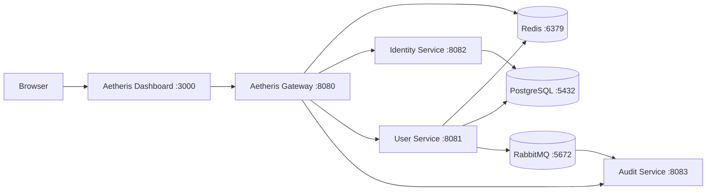

# Aetheris Platform

**Build. Secure. Observe. Orchestrate.**

Aetheris is an open-source distributed API, identity, observability, and AI-agent platform built with Java, Spring Boot, React, PostgreSQL, Redis, RabbitMQ, and cloud-native technologies.


## Current milestone — Stage 4

Stage 4 introduces asynchronous domain events through RabbitMQ. User lifecycle changes are published to a durable topic exchange and consumed by a dedicated audit service. Stage 3 Redis caching/rate limiting and Stage 2 identity/security remain in place.



## Quick start

Prerequisite: Docker Desktop or Docker Engine with Compose.

```bash
git clone https://github.com/teldigi5-wq/aetheris-platform.git
cd aetheris-platform
docker compose up --build
```

Then open:

- Dashboard: `http://localhost:3000`
- Gateway health: `http://localhost:8080/actuator/health`
- Identity API: `http://localhost:8080/api/auth/*`
- Protected User API: `http://localhost:8080/api/users`
- Protected Event API: `http://localhost:8080/api/events`
- User-service Swagger UI: `http://localhost:8081/swagger-ui.html`
- OpenAPI JSON: `http://localhost:8081/v3/api-docs`
- Redis: `localhost:6379`
- RabbitMQ AMQP: `localhost:5672`
- RabbitMQ Management UI: `http://localhost:15672` (`aetheris` / `aetheris` for local development)

## Stage 2 security model

Access tokens are short-lived signed JWTs containing identity, role, and effective scope claims. Refresh tokens are opaque, rotated on use, revocable, and stored only as SHA-256 hashes in PostgreSQL. The gateway validates access tokens and enforces scopes before forwarding protected requests.

Default role scopes:

- `API_CONSUMER`: `users:read`, `services:read`
- `DEVELOPER`: `users:read`, `users:write`, `services:read`, `identity:read`
- `ADMIN`: all developer scopes plus `identity:write`

## Stage 3 traffic model

Redis serves two distributed-platform responsibilities:

- shared cache for user reads, with a 60-second TTL and eviction after user writes
- shared gateway token buckets so limits are consistent across future gateway replicas

Default local limits:

- identity endpoints: 5 requests/second, burst 10
- user endpoints: 10 requests/second, burst 20

Spring Cloud Gateway emits rate-limit response headers and returns HTTP `429 Too Many Requests` when a bucket is exhausted.

## Stage 4 event model

The user service publishes portable JSON domain events to the durable topic exchange `aetheris.events` using routing keys such as `user.created` and `user.deleted`. The audit service consumes `user.*` events from the durable queue `aetheris.audit.user-events` and exposes its recent consumed events through the protected `/api/events` endpoint.

Runtime verification confirms RabbitMQ health, an active queue/consumer, successful `user.created` delivery, successful `user.deleted` delivery, and protected event retrieval through the gateway.

This stage demonstrates asynchronous communication, topic routing, durable queues, service decoupling, eventual consistency, and consumer-based event processing. A transactional outbox is intentionally left as a later hardening step so the difference between simple event publication and guaranteed database/message atomicity can be discussed in interviews.

## Engineering goals

Aetheris is intentionally being built around problems that appear in real platform engineering interviews: API management, identity, security, distributed communication, caching, traffic management, messaging, resilience, observability, cloud-native deployment, and agent governance. Each stage adds a small number of concepts so the architecture remains explainable rather than becoming a collection of unrelated technologies.

## Roadmap

- [x] Stage 1 — Gateway + user microservice + PostgreSQL
- [x] Stage 1.5 — Dashboard, DTO/service layers, OpenAPI, structured errors, stronger CI
- [x] Stage 2 — Identity service, JWT authentication, RBAC, refresh tokens, scoped permissions
- [x] Stage 3 — Redis caching and distributed rate limiting
- [x] Stage 4 — RabbitMQ event messaging
- [ ] Stage 5 — Prometheus, Grafana, centralized logs, OpenTelemetry
- [ ] Stage 6 — Circuit breakers, retries, timeouts, load balancing
- [ ] Stage 7 — Local Kubernetes + Helm
- [ ] Stage 8 — Aetheris CLI + SDK generation
- [ ] Stage 9 — AI Agent Gateway, policy engine, local Ollama integration
- [ ] Stage 10 — Chaos Lab + Security Lab

## Zero-cost design rule

The development stack has no mandatory recurring software fee. Local Docker infrastructure and open-source components are the default. Cloud deployment is optional, not required to run or demonstrate the platform.

## Documentation

- [Architecture](docs/architecture.md)
- [Interview talking points](docs/interview-guide.md)
- [Token flow and threat model](docs/security/token-flow.md)

## Author

Built by **Poojana Kaveesh Sellahewa** as a long-term software engineering and distributed-systems portfolio project.
