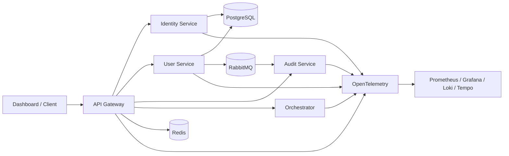

<div align="center">

# Aetheris Platform

### Cloud-native distributed systems engineering with an experimental AI control plane

**A portfolio project centered on secure backend services, distributed systems, observability, resilience and Kubernetes — with later Syntra/Aetheris automation research kept as a clearly separated extension track.**


`Java 21` • `Spring Boot` • `PostgreSQL` • `Redis` • `RabbitMQ` • `Resilience4j` • `OpenTelemetry` • `Prometheus` • `Grafana` • `Loki` • `Tempo` • `Kubernetes` • `Helm` • `React + TypeScript`

</div>

---

## Portfolio pitch

The strongest way to evaluate Aetheris is as a **platform-engineering project first**.

The core system demonstrates a coherent progression through:

1. API gateway and service boundaries;
2. identity, JWT access tokens and refresh-token lifecycle;
3. PostgreSQL persistence, Redis caching and traffic controls;
4. asynchronous RabbitMQ events and audit processing;
5. metrics, logs and traces with OpenTelemetry and the Grafana stack;
6. bounded resilience with safe retry behavior;
7. Docker, Kubernetes and Helm deployment foundations.

Those areas are the **primary recruiter/interview story** because they are concrete, independently understandable and directly visible in code and deployment assets.

After the cloud-native platform foundation, the repository also grew a separate **experimental control-plane track** for Syntra/Aetheris AI orchestration, browser/operator research, deterministic approvals and evidence-driven automation. Those extensions are real repository work, but they have different maturity levels and must not be confused with the proven core platform.

See **[Portfolio scope & maturity](docs/portfolio-scope.md)** for the exact separation.

---

## What to review first

| If you have... | Start here |
|---|---|
| **2 minutes** | This README → **Core platform track** → architecture diagram |
| **10 minutes** | [Demo guide](docs/demo-guide.md) → gateway/auth → messaging → observability |
| **Interview prep** | [Interview guide](docs/interview-guide.md) → [Architecture decisions](docs/architecture-decisions.md) |
| **AI/operator interest** | [Portfolio scope & maturity](docs/portfolio-scope.md) → [Architecture](docs/architecture.md) |
| **Repository governance interest** | [Verification checklist](docs/verification-checklist.md) → [Master roadmap](docs/master-roadmap.md) |

---

## Core platform track — primary portfolio story

### 1. Gateway and service boundaries

A Spring Cloud Gateway provides one ingress surface in front of independently bounded services. The repository separates identity, user-domain, audit/event and orchestration responsibilities instead of collapsing them into one application.

### 2. Identity and token lifecycle

The identity service implements registration, login, refresh and logout flows around JWT access tokens and refresh-token state. Refresh tokens are treated as credentials: rotation/revocation and stored token hashes are part of the design rather than storing reusable plaintext refresh credentials.

### 3. Persistence, cache and traffic controls

PostgreSQL provides durable relational state. Redis supports low-latency distributed concerns such as caching/rate-related controls. Security-sensitive behavior is designed to fail closed rather than silently weakening authorization when an infrastructure dependency is unhealthy.

### 4. Messaging and audit flow

RabbitMQ supports asynchronous event delivery so audit/event processing does not have to block every synchronous user request. This creates an explicit delivery and failure boundary that can be observed and reasoned about.

### 5. Observability

The project includes OpenTelemetry instrumentation foundations plus Prometheus, Grafana, Loki and Tempo for metrics, visualization, logs and traces.

### 6. Resilience

Resilience4j policies demonstrate circuit breaking and bounded retry behavior. Retrying is intentionally constrained to operations where repetition is safe rather than being applied blindly to mutating requests.

### 7. Deployment

Docker Compose provides the fast local integration path. Kubernetes and Helm assets demonstrate health/readiness, replicas, deployment topology and cloud-native operational concepts.

---

## Core architecture



The core story remains useful even if the optional AI/operator track is ignored entirely.

---

## Experimental control-plane extensions

The repository later expanded beyond the original cloud-native foundation. These extensions are intentionally presented as a **secondary engineering/research track**, not as evidence that every planned AI capability already works on a production workstation.

| Extension | Current maturity |
|---|---|
| Agent/orchestration service | Repository implemented and tested |
| Deterministic owner policy / scoped approvals | Repository implemented and regression-tested |
| Reasoning / verification components | Repository implemented; not a claim of human-level autonomy |
| Digital-twin / recovery foundations | Repository-side models and bounded recovery logic |
| Generic browser operator | Repository adapter implemented; physical runtime not yet validated |
| LinkedIn/Vercel site skills | Repository templates only; exact site flows not physically validated |
| PC-care / workstation integration | Pre-PC repository foundation; physical validation pending |
| Trading intelligence | Fail-closed research/risk foundation; live-money authority disabled |

The architectural rule is simple: **models may propose actions, but they are not the final policy authority**. Repository-side automation remains subject to deterministic policy, approval and verification rules.

---

## Quick start

### Prerequisites

- Git
- Docker with Docker Compose v2

Java 21, Node and Python are needed only when running individual modules or repository validators directly.

### Start the core stack

```bash
git clone https://github.com/teldigi5-wq/aetheris-platform.git
cd aetheris-platform
docker compose up --build
```

Core local surfaces:

| Surface | Local address |
|---|---|
| Dashboard | `http://localhost:3000` |
| API Gateway | `http://localhost:8080` |
| User Service | `http://localhost:8081` |
| Identity Service | `http://localhost:8082` |
| Audit Service | `http://localhost:8083` |
| Orchestrator | `http://localhost:8090` |
| RabbitMQ management | `http://localhost:15672` |

Compose credentials and fallback secrets are **development-only defaults**.

### Start observability

```bash
docker compose --profile observability up --build
```

Additional surfaces include Grafana on `http://localhost:3001`, Prometheus on `http://localhost:9090`, Tempo on `http://localhost:3200` and Loki on `http://localhost:3100`.

See **[docs/demo-guide.md](docs/demo-guide.md)** for the recommended reviewer sequence.

---

## Security and reliability highlights

- access/refresh token lifecycle is treated as a credential-management problem, not just JWT generation;
- persistence entities are not used as public API contracts by default;
- Redis/RabbitMQ failures are explicit infrastructure failures, not reasons to weaken authorization;
- retries are limited to operations where repetition is safe;
- secrets should never be committed, logged or included in evidence artifacts;
- stable `main` is protected and changes are promoted through pull requests and CI;
- dependency lockdown, CodeQL and reproducibility checks provide repository-level evidence.

For the detailed security model, see **[Token flow and threat model](docs/security/token-flow.md)**.

---

## Kubernetes / Helm and operational story

The deployment track is intended to demonstrate more than “I wrote a Dockerfile.” Reviewers can inspect:

- Kubernetes deployments/services;
- health/readiness behavior;
- replica configuration and scaling concepts;
- Helm packaging and configuration;
- observability integration;
- recovery behavior when services become unavailable.

See **[Architecture](docs/architecture.md)** and **[Demo guide](docs/demo-guide.md)**.

---

## AI/operator track: explicit truth boundary

The later Syntra/Aetheris work has repository evidence, but some runtime claims depend on hardware and authenticated external services that have not yet been physically tested on the target PC.

**Physical-machine status:** `BLOCKED_PENDING_HARDWARE`  
**Physical-PC validation remains pending.** Hosted CI and repository evidence are not substitutes for validation on the owner's target machine.

That means the repository does **not** currently claim that WSL2, Docker Desktop, GPU acceleration, local-model latency, thermals, voice hardware, Chrome/Edge WebDriver sessions, LinkedIn automation or Vercel browser automation are validated on the future owner PC.

---

## Roadmap history and why Stage 34 / 34 still appears

The repository contains two different historical tracks:

1. the original cloud-native platform progression, which is the primary portfolio narrative;
2. the later Syntra × Aetheris master roadmap, which expanded the repository into AI orchestration, governance and pre-PC automation research.

The later repository roadmap reached **Stage 34 / 34**. That statement is retained for historical/validation-contract consistency; it is **not** the headline claim for the portfolio and it does not mean every aspirational subsystem is production-ready.

There is no Stage 35. New work after that roadmap is treated as normal engineering passes or versioned capabilities, not as an attempt to inflate the stage count.

For the full historical record see **[docs/master-roadmap.md](docs/master-roadmap.md)**.

---

## Verification and stable history

Stable `main` is protected by the repository ruleset **`Protect stable main`**.

Canonical development line: `feature/syntra-aetheris-foundation-v2`.

The verification surface includes backend tests, dashboard builds, workstation-agent checks, compatibility-contract freeze, CodeQL for Java and JavaScript/TypeScript, dependency lockdown, two-pass reproducibility and later control-plane regression checks.

Hosted CI is repository evidence, **not physical-PC validation**.

---

## Repository map

```text
aetheris-platform/
├── gateway/                 API ingress and cross-cutting gateway concerns
├── identity-service/        Authentication and token lifecycle
├── user-service/            User-domain service and persistence
├── audit-service/           Audit/event consumption surface
├── orchestrator-service/    Optional orchestration/control-plane extensions
├── workstation-agent/       Pre-PC workstation integration foundation
├── dashboard/               React + TypeScript operator UI
├── aetheris-reasoning/      Experimental reasoning/verification components
├── aetheris-quant/          Fail-closed quant/trading research foundation
├── observability/           Prometheus/Grafana/Loki/Tempo/OTel config
├── deploy/                  Kubernetes and Helm assets
├── docs/                    Architecture, security, runbooks and scope docs
└── build-evidence/          Repository-side validation evidence/contracts
```

---

## What this project demonstrates in an interview

| Area | Discussion value |
|---|---|
| Backend engineering | API boundaries, DTOs, validation, persistence and failure behavior |
| Security | token lifecycle, authorization assumptions and secret hygiene |
| Distributed systems | gateway topology, Redis, RabbitMQ and asynchronous audit flow |
| Reliability | circuit breaking, safe retry decisions and failure containment |
| Observability | metrics, logs, traces and distributed debugging |
| DevOps | Docker Compose, Kubernetes, Helm and reproducible CI |
| AI systems — optional | tool/model separation, policy, approvals and verification |
| Engineering communication | ADRs, runbooks, scope/maturity labeling and trade-off reasoning |

The recommended interview approach is to **defend the core platform first** and discuss the AI/operator extensions only when relevant to the role or interviewer.

---

## Documentation

### Reviewer / recruiter path

- [Portfolio scope & maturity](docs/portfolio-scope.md)
- [Demo guide](docs/demo-guide.md)
- [Interview guide](docs/interview-guide.md)
- [Architecture decisions](docs/architecture-decisions.md)
- [Architecture](docs/architecture.md)

### Deep engineering / governance path

- [Master roadmap](docs/master-roadmap.md)
- [Master build specification](docs/master-build-spec.md)
- [Verification checklist](docs/verification-checklist.md)
- [First-boot runbook](docs/first-boot-runbook.md)
- [Versioning and release classes](docs/versioning.md)
- [Release-readiness checklist](docs/release-readiness.md)

---

## Release status

A repository pre-PC candidate named `v0.1.0-pre-pc` has been prepared but not published. A repository-recognized software license has not yet been selected, so this repository should not imply third-party reuse rights that the owner has not explicitly granted.

---

## Contributing

Read **[CONTRIBUTING.md](CONTRIBUTING.md)** before changing code, especially identity, policy, workstation, trading or deployment surfaces.

Security-sensitive findings should follow **[SECURITY.md](SECURITY.md)** and should never include secrets in a public issue.

---

<div align="center">

### Build. Secure. Observe. Deploy. Verify.

**Built by Poojana Kaveesh Sellahewa**

</div>
