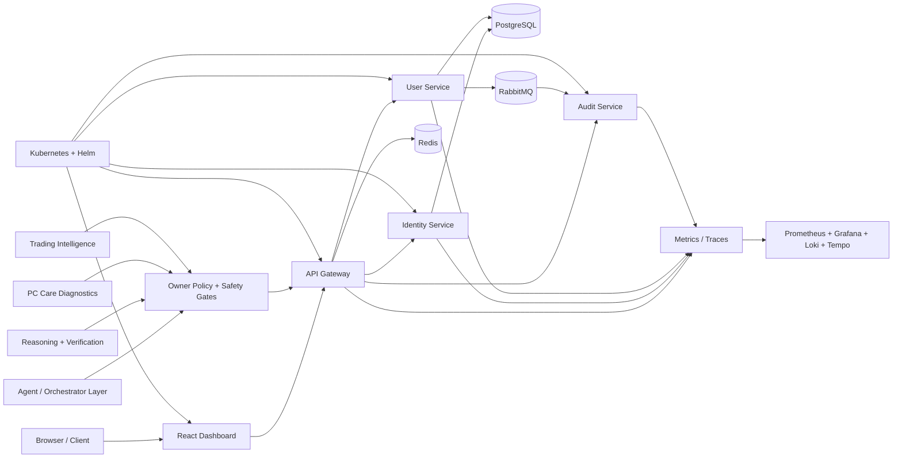

<div align="center">

# ⚡ Aetheris Platform

### Build. Secure. Observe. Orchestrate. Verify.

**A long-term platform engineering and local-AI foundation focused on secure services, agent governance, deterministic verification, owner-controlled automation, trading safeguards, system engineering and advanced reasoning.**


`Java 21` • `Spring Boot` • `React` • `PostgreSQL` • `Redis` • `RabbitMQ` • `Prometheus` • `Grafana` • `OpenTelemetry` • `Kubernetes` • `Helm` • `Python verification tooling`

</div>

---

## 🎯 What Aetheris demonstrates

Aetheris is an engineering portfolio and experimentation platform that grows one capability at a time instead of collecting disconnected demos. The repository includes API platform work, identity and authorization, distributed data services, observability, resilience, deployment automation, AI-agent governance, safety policy, deterministic release evidence, repository governance, PC/system-engineering controls, fail-closed trading intelligence and a dedicated reasoning/verification control plane.

> **Portfolio goal:** every important capability should be explainable in an interview, visible in code, and backed by reproducible evidence rather than unsupported claims.

---

## ✅ Current repository milestone — Stage 30 / 34

The canonical development line has reached **Stage 30 — Advanced reasoning, verification and decision systems** on the repository/CI side.

Current repository status: **`PRE_PC_HARDENED + STAGE30_REASONING`**.

Current physical-machine status: **`BLOCKED_PENDING_HARDWARE`**.

**Physical-PC validation remains pending.** Hosted CI and repository evidence do not prove that WSL2, Docker Desktop, GPU acceleration, local-model performance, thermals, storage health or the complete local stack work on the owner's future physical machine.

### Stage 30 result

Stage 30 adds a deterministic reasoning-control layer under [`aetheris-reasoning/`](aetheris-reasoning/) rather than treating one model as infallible. The foundation includes:

- meta-reasoning route selection;
- uncertainty/confidence assessment;
- independent verifier/critic checks;
- simulation gates for risky or irreversible side effects;
- a tamper-evident SHA-256 decision ledger;
- source trust and lineage classification;
- contradiction detection;
- temporal validity/change reasoning;
- deterministic owner-rule compilation with conflict detection;
- task dependency graphs and cycle detection;
- change-impact analysis before execution.

Stage 30 does **not** silently execute external side effects. Critical or irreversible high-consequence work escalates, and unsupported natural-language policy phrasing fails closed for owner review rather than being guessed.

### Stage 29 result

Stage 29 adds fail-closed trading-intelligence policy and verification. Repository tests cover setup-score boundaries, risk-per-trade limits, leverage caps, reward/risk geometry, stop distance, daily-loss lockout, open-position limits, short/long geometry, invalid numeric inputs, deterministic serialization and disabled live/testnet execution boundaries.

Trading outputs remain proposals and hypotheses rather than guaranteed profit. Live-money execution, withdrawals and transfers remain outside the default trusted path.

### Stage 28 result

Stage 28 adds deterministic PC-health diagnosis and remediation planning using synthetic fixtures only. It covers CPU pressure, memory pressure, disk-free-space pressure and temperature pressure while preserving a strict no-mutation boundary.

Pre-PC Stage 28 does **not** autonomously kill processes, delete files, edit the Registry, change drivers, restart services, reboot/shutdown the host, change networking or weaken security controls. Any future mutating remediation remains owner-approval gated and requires real physical-machine validation first.

### Repository governance

The intended long-lived branch model remains:

- **`main`** — stable/release history.
- **`feature/syntra-aetheris-foundation-v2`** — canonical active development line.

Stage 30 was reconciled onto the mature development line instead of discarding its Stage 24–29 history. Temporary reconciliation branches are not future development bases.

GitHub administrative branch protection/rulesets remain a separate account/repository setting. Repository-side CI does not substitute for GitHub-hosted protection.

---

## 🌿 Development-line policy

All new PC-independent Syntra/Aetheris roadmap work continues from:

`feature/syntra-aetheris-foundation-v2`

Only reviewed promotion work should move toward `main`. New roadmap stages must branch from the current canonical development tip, not from stale merged stage branches.

---

## 🏗️ Architecture



### Core engineering domains

| Domain | What Aetheris implements |
|---|---|
| API platform | Gateway routing, protected endpoints, structured failures |
| Identity | JWT access tokens, refresh-token rotation, RBAC and scopes |
| Data | PostgreSQL persistence with shared service data |
| Distributed systems | Redis caching/rate limiting and RabbitMQ events |
| Resilience | Circuit breakers, retries, timeouts and fallbacks |
| Observability | Metrics, logs and distributed traces |
| Cloud native | Docker Compose, Kubernetes, Helm and health probes |
| AI/agents | Mission planning, safe tool registry, policy evaluation and orchestrator foundations |
| Reasoning | Confidence/uncertainty routing, verifier/critic checks, simulation gates and decision ledger |
| Safety | Approval gates, dry-run controls, incident replay and regression certification |
| Release integrity | Dependency lockdown, reproducible builds, contract freeze and deterministic evidence |
| Repository governance | Canonical development-line enforcement and release-promotion checks |
| PC care | Deterministic health classification and recommendations-only remediation planning before hardware validation |
| Trading | Fail-closed proposal generation, deterministic risk limits and disabled live-money defaults |

---

## 🧠 Stage 30 reasoning-control model

```text
Task / command
    |
    v
Meta-reasoning router
    |
    +--> deterministic/direct path
    +--> local model / specialist path
    +--> research / evidence path
    +--> simulation path
    +--> council / multi-review path
    +--> owner-approval path
    |
    v
Verifier / critic
    |
    v
Policy + source trust + contradiction + temporal checks
    |
    v
Decision ledger
    |
    v
Approved execution boundary
```

Models may recommend actions, but they do not outrank deterministic owner policy or verification requirements.

---

## 🔐 Security and owner-control model

Access tokens use signed JWTs containing identity, role and effective-scope claims. Refresh tokens are opaque, rotated on use, revocable and stored as hashes.

The agent/orchestrator side adds owner-policy evaluation before high-impact operations. Repository safeguards keep critical pre-PC boundaries fail-closed: no production activation, no live-money execution, no withdrawals, no transfers, no unrestricted shell capability, no autonomous PC repair and no administrative bypass is considered validated by hosted CI.

Stage 30 extends this with explicit confidence, verification, simulation and owner-approval routing rather than trusting model output by default.

---

## 🧪 Verification and CI

The canonical development line uses pinned GitHub Action revisions and deterministic validation where practical. Current gates include:

- Java service tests including the orchestrator;
- workstation-agent packaging and safety checks;
- dashboard frozen dependency install/build;
- release hardening and deterministic evidence;
- compatibility contract freeze;
- dependency lockdown and reproducible-build verification;
- Stage 25–29 stage-specific validation;
- Stage 30 reasoning tests, repeated to catch hidden state coupling;
- CodeQL analysis for Java and JavaScript/TypeScript.

CI success is repository evidence, not proof of physical-machine behavior.

---

## 📈 Observability and resilience

The platform contains Prometheus/Grafana/Loki/Tempo/OpenTelemetry integration, structured health checks and resilience patterns such as timeouts, retries for safe reads, circuit breakers and controlled fallbacks.

These are repository capabilities and testable deployment definitions. Runtime performance on the owner's physical hardware is intentionally left unclaimed until physical validation exists.

---

## 🚀 Development quick start

Repository definitions include Docker Compose, Helm and service-level development workflows. Use the first-boot and validation runbooks before treating any local environment as validated:

- [`docs/first-boot-runbook.md`](docs/first-boot-runbook.md)
- [`docs/stage-25-first-boot-readiness.md`](docs/stage-25-first-boot-readiness.md)
- [`docs/stage-26-safety-certification.md`](docs/stage-26-safety-certification.md)
- [`docs/stage-27-repository-governance.md`](docs/stage-27-repository-governance.md)
- [`docs/stage-28-pc-care-system-engineering.md`](docs/stage-28-pc-care-system-engineering.md)
- [`docs/stage-29-trading-intelligence-execution.md`](docs/stage-29-trading-intelligence-execution.md)
- [`docs/stage-30-reasoning.md`](docs/stage-30-reasoning.md)
- [`docs/master-roadmap.md`](docs/master-roadmap.md)
- [`docs/github-branch-protection.md`](docs/github-branch-protection.md)

### Stage 30 tests

```bash
cd aetheris-reasoning
python -m unittest discover -s tests -v
```

The exact commands appropriate for full local execution depend on the machine and validation stage. The project intentionally does not claim successful owner-PC execution before that machine is available and tested.

---

## 🗺️ Engineering progression

Recent milestones include:

- **Stage 21** — physical-target pilot contract and owner-policy boundaries;
- **Stage 22** — release hardening, schema/security evidence and merge readiness;
- **Stage 23** — frozen compatibility contract;
- **Stage 24** — dependency lockdown and reproducible-build verification;
- **Stage 25** — deterministic first-boot readiness bundle and physical-PC truth boundary;
- **Stage 26** — deterministic safety certification plus evidence-integrity controls;
- **Stage 27** — canonical branch governance and release-promotion gate;
- **Stage 28** — deterministic PC-care diagnostics and safe remediation planning;
- **Stage 29** — fail-closed trading intelligence and execution-policy foundation;
- **Stage 30** — advanced reasoning, verification and decision-control foundation.

### Next: Stage 31

**Digital twins, proactive intelligence and self-healing** — structured project/PC state models, proactive issue detection, priority management, bounded recovery, staged safe updates and automatic model/runtime benchmarking.

Physical execution milestones remain blocked until suitable owner hardware exists.

---

## 📚 Documentation

- [Architecture](docs/architecture.md)
- [Interview talking points](docs/interview-guide.md)
- [Token flow and threat model](docs/security/token-flow.md)
- [Resilience runbook](docs/resilience.md)
- [Kubernetes + Helm runbook](docs/kubernetes.md)
- [First-boot runbook](docs/first-boot-runbook.md)
- [Stage 25 first-boot readiness](docs/stage-25-first-boot-readiness.md)
- [Stage 26 safety certification](docs/stage-26-safety-certification.md)
- [Stage 27 repository governance](docs/stage-27-repository-governance.md)
- [Stage 28 PC care & system engineering](docs/stage-28-pc-care-system-engineering.md)
- [Stage 29 trading intelligence & execution](docs/stage-29-trading-intelligence-execution.md)
- [Stage 30 reasoning & verification](docs/stage-30-reasoning.md)
- [Master roadmap](docs/master-roadmap.md)
- [GitHub branch protection target](docs/github-branch-protection.md)

---

## 💡 Design rule

The development stack is designed around **no mandatory recurring AI or platform subscription fee**. Open-source and locally controllable components are the default; external/cloud services remain optional and policy-governed.

---

<div align="center">

### From platform fundamentals to policy-governed local AI infrastructure.

**Built by Poojana Kaveesh Sellahewa**

</div>
