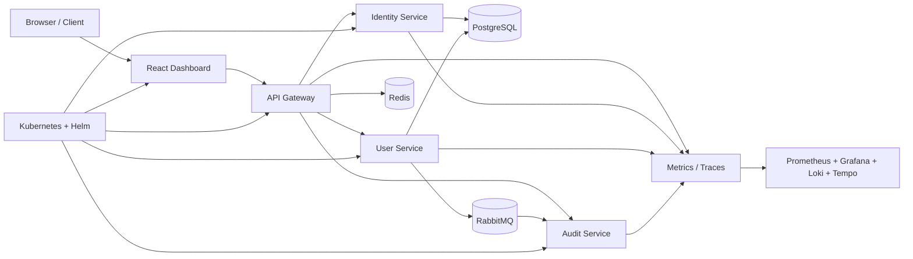

<div align="center">

# ⚡ Aetheris Platform

### Build. Secure. Observe. Orchestrate.

**A cloud-native platform engineering project for APIs, identity, distributed systems, observability and future AI-agent governance.**


`Java 21` • `Spring Boot` • `React` • `PostgreSQL` • `Redis` • `RabbitMQ` • `Prometheus` • `Grafana` • `OpenTelemetry` • `Kubernetes` • `Helm`

</div>

---

## 🎯 What Aetheris demonstrates

Aetheris is a long-term engineering portfolio project designed to show how a modern platform grows from a small service into a distributed, observable and cloud-native system.

Instead of building isolated demos, each stage adds one production-relevant capability to the same platform: authentication, authorization, caching, rate limiting, event messaging, observability, resilience, Kubernetes deployment and eventually AI-agent governance.

> **Portfolio goal:** make every architectural decision explainable in an interview and verifiable with evidence.

---

## ✅ Current repository milestone

The repository contains the Stage 7 Docker Compose and Kubernetes + Helm implementation: PostgreSQL, Redis, RabbitMQ, gateway, identity, user, audit and dashboard workloads, plus Services, persistent volumes, ConfigMaps, Secrets, resource requests/limits, health probes and configurable replicas.

**Owner-PC runtime validation is still pending.** Until the owner's physical machine exists and produces its own evidence, this repository does not claim that WSL2, Docker Desktop, Kubernetes, GPU acceleration or the complete local stack have passed on that machine.

Stage 24 added reproducible dependency/build evidence. Stage 25 adds an executable first-boot readiness contract and the runbook that will be used for real physical-machine acceptance.

---

## 🏗️ Architecture



### Core engineering domains

| Domain | What Aetheris implements |
|---|---|
| API platform | Gateway routing, protected endpoints, structured failures |
| Identity | JWT access tokens, refresh-token rotation, RBAC and scopes |
| Data | PostgreSQL persistence with shared service data |
| Distributed systems | Redis caching/rate limiting and RabbitMQ events |
| Resilience | Circuit breakers, retries, timeouts and fallbacks |
| Observability | Metrics, logs and distributed traces |
| Cloud native | Docker Compose, Kubernetes, Helm and health probes |
| Future AI | Agent gateway, policies and local-model integration roadmap |

---

## 🔐 Security model

Access tokens are signed JWTs containing identity, role and effective scope claims. Refresh tokens are opaque, rotated on use, revocable and stored only as SHA-256 hashes in PostgreSQL.

The gateway validates tokens and enforces scopes before protected requests reach downstream services.

| Role | Default permissions |
|---|---|
| `API_CONSUMER` | `users:read`, `services:read` |
| `DEVELOPER` | consumer scopes + `users:write`, `identity:read` |
| `ADMIN` | developer scopes + `identity:write` |

---

## ⚡ Distributed traffic model

Redis provides shared caching and distributed token-bucket rate limiting. User-cache entries use a 60-second TTL and are evicted on writes.

RabbitMQ carries asynchronous `user.created` and `user.deleted` events to the audit service through the durable `aetheris.events` topic exchange.

---

## 📈 Observability

Each Java service exposes Prometheus metrics through Spring Boot Actuator. The observability stack combines:

- **Prometheus** for metrics
- **Grafana** for dashboards
- **Loki** for centralized logs
- **Tempo** for traces
- **OpenTelemetry** for instrumentation and trace export
- **Grafana Alloy** for container log discovery

The observability profile remains optional so the core platform stays practical on lower-memory development hardware.

---

## 🛡️ Resilience

The gateway protects downstream calls with Resilience4j circuit breakers and explicit network timeouts.

Safe reads can retry with exponential backoff, while mutating requests are not replayed automatically. Dependency failures return structured `503` responses instead of leaking raw connection errors.

---

## ☸️ Kubernetes + Helm

The Helm chart under `deploy/helm/aetheris` describes the core platform in one namespace.

Kubernetes Services provide stable internal DNS, stateful infrastructure receives persistent volumes, stateless services use Deployments and health probes keep traffic away from unready pods.

The default values are intended for local development. A production deployment still requires external secret management, stronger storage/backup policies, ingress/TLS, deployment-specific image/version policy and separate production values.

---

## 🚀 Quick start

These commands describe the intended local workflow. On the owner's physical PC, follow the [first-boot runbook](docs/first-boot-runbook.md) and record evidence rather than assuming the environment works.

### Docker Compose

```bash
git clone https://github.com/teldigi5-wq/aetheris-platform.git
cd aetheris-platform
docker compose up --build
```

### Full observability stack

```bash
docker compose --profile observability up --build
```

### Main local endpoints

| Service | URL |
|---|---|
| Dashboard | `http://localhost:3000` |
| Gateway health | `http://localhost:8080/actuator/health` |
| Identity API | `http://localhost:8080/api/auth/*` |
| User API | `http://localhost:8080/api/users` |
| Event API | `http://localhost:8080/api/events` |
| RabbitMQ UI | `http://localhost:15672` |
| Prometheus | `http://localhost:9090` |
| Grafana | `http://localhost:3001` |
| Loki | `http://localhost:3100` |
| Tempo | `http://localhost:3200` |

For Kubernetes deployment, see [`docs/kubernetes.md`](docs/kubernetes.md).

---

## 🧪 Pre-PC hardening track

- [x] Stage 24 — Reproducible Build & Dependency Lockdown
- [x] Stage 25 preparation — First-Boot Readiness & Environment Contract
- [ ] Physical-PC acceptance — Windows/WSL2/Docker/GPU/local-stack evidence after the owner's machine arrives

Stage 25 CI validates repository-side readiness only. It intentionally reports the physical PC as **NOT_TESTED**.

---

## 🗺️ Platform roadmap

- [x] Stage 1 — Gateway + user service + PostgreSQL
- [x] Stage 1.5 — Dashboard, DTO/service layers, OpenAPI, structured errors and CI
- [x] Stage 2 — Identity, JWT authentication, RBAC, refresh tokens and scopes
- [x] Stage 3 — Redis caching + distributed rate limiting
- [x] Stage 4 — RabbitMQ event messaging
- [x] Stage 5 — Prometheus, Grafana, logs and OpenTelemetry
- [x] Stage 6 — Circuit breakers, retries, timeouts and load balancing
- [x] Stage 7 — Kubernetes + Helm implementation
- [ ] Stage 8 — Aetheris CLI + SDK generation
- [ ] Stage 9 — AI Agent Gateway + policy engine + local Ollama integration
- [ ] Stage 10 — Chaos Lab + Security Lab

Hardware-dependent roadmap items remain gated by real-machine validation.

---

## 📚 Documentation

- [Architecture](docs/architecture.md)
- [Interview talking points](docs/interview-guide.md)
- [Token flow and threat model](docs/security/token-flow.md)
- [Resilience runbook](docs/resilience.md)
- [Kubernetes + Helm runbook](docs/kubernetes.md)
- [Dependency and supply-chain policy](docs/dependency-policy.md)
- [Stage 24 reproducibility evidence](docs/stage-24-reproducible-build.md)
- [Stage 25 readiness contract](docs/stage-25-first-boot-readiness.md)
- [Physical-PC first-boot runbook](docs/first-boot-runbook.md)

---

## 💡 Design rule

The development stack has **no mandatory recurring software fee**. Open-source components and local infrastructure are the default; cloud deployment remains optional.

---

<div align="center">

### From fundamentals to production-style platform engineering.

**Built by Poojana Kaveesh Sellahewa**

</div>
