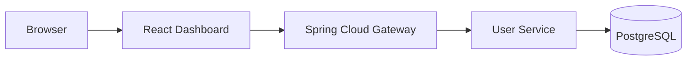

# Aetheris Architecture

## Stage 1.5 topology

### Component responsibilities

| Component | Responsibility | Current boundary |
| --- | --- | --- |
| Dashboard | Operator/developer UI | Observes health and exercises APIs |
| Gateway | Single entry point | Routing + CORS; security/rate limiting arrive later |
| User Service | User domain logic | Validation, DTO mapping, persistence |
| PostgreSQL | Durable storage | User records |

## Why an API gateway?

Clients use one stable ingress instead of knowing every internal service address. Later stages can centralize authentication, authorization, rate limiting, request correlation, policy enforcement and observability here. The trade-off is that the gateway becomes critical infrastructure and must eventually be scaled and monitored carefully.

## Why a service layer and DTOs?

Controllers now handle HTTP concerns while `UserService` owns use-case logic. Persistence entities are no longer returned directly. This avoids coupling the public API contract to the database model and gives future identity/security changes a clearer place to live.

## Failure behavior

- Invalid input returns HTTP 400 with structured field errors.
- Duplicate email returns HTTP 409.
- Unknown user IDs return HTTP 404.
- PostgreSQL startup is protected by a Compose health check before the user service starts.

## Principles

- Clear service boundaries
- Secure-by-design evolution
- Observable components
- Reproducible local development
- Zero mandatory recurring software cost
- Architecture decisions that can be explained in an interview
