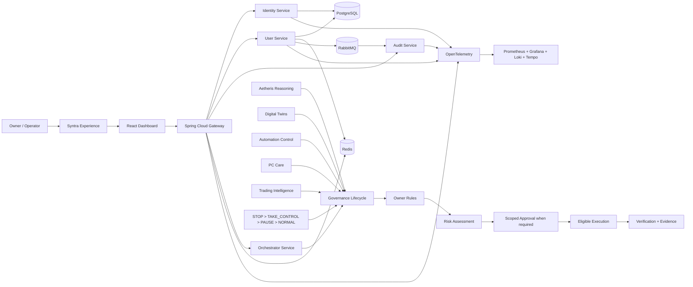

# Aetheris Architecture

This document describes the current repository architecture after completion of the 34-stage repository roadmap. It replaces the early-stage topology notes that no longer represented the system.

## 1. System intent

Aetheris is a modular platform/control plane supporting distributed APIs, identity, observability, automation, reasoning, digital twins, owner policy and evidence-driven execution. Syntra is the owner-facing assistant experience that sits above Aetheris; models are replaceable reasoning workers rather than policy authority.

The architecture is deliberately split into three planes:

1. **Experience plane** — dashboard and Syntra-facing interaction surfaces.
2. **Platform plane** — gateway, identity, user, audit, orchestration, persistence, messaging and observability.
3. **Governance plane** — deterministic owner rules, risk assessment, scoped approvals, emergency precedence, execution verification and evidence.

## 2. Current topology



## 3. Component responsibilities

| Component | Primary responsibility | Important boundary |
|---|---|---|
| Dashboard | Operator/developer UI | Presents platform state; it is not the policy authority |
| API Gateway | Stable ingress and cross-cutting enforcement | Routes requests and applies trusted boundary controls |
| Identity Service | Registration, login, refresh and logout/token lifecycle | Credentials and refresh tokens are security-sensitive state |
| User Service | User-domain logic and persistence | API DTOs remain separated from persistence entities |
| Audit Service | Consumes/records audit-relevant events | Audit evidence should not be confused with execution authority |
| Orchestrator Service | Coordinates missions, tools, automation and governance foundations | Tool eligibility does not imply successful execution |
| Workstation Agent | Bounded workstation integration foundation | Unrestricted privileged host authority is not a validated default |
| Aetheris Reasoning | Reasoning/verification utilities | Models and reasoning workers cannot override deterministic policy |
| Aetheris Quant | Quant/trading proposal foundation | Live-money authority is disabled by default |
| PostgreSQL | Durable relational state | Development credentials are not production credentials |
| Redis | Distributed cache/rate/policy-support state | Availability/failure must not silently weaken authorization |
| RabbitMQ | Asynchronous event transport | Consumers must treat messages as untrusted until validated |
| Observability stack | Metrics, traces, logs and dashboards | Telemetry is evidence, not proof of business success by itself |

## 4. Request and identity flow

The normal service-facing path is:

```text
Client / Dashboard
  → API Gateway
  → authentication / authorization boundary
  → downstream service
  → persistence / cache / messaging as needed
  → response
  → audit / metrics / traces
```

Identity endpoints are exposed by the identity service under `/api/auth`, including registration, login, refresh and logout flows. Refresh tokens are treated as credentials and are validated/rotated according to the identity implementation.

The gateway is a centralized ingress point, but downstream components should still preserve their own authorization assumptions rather than blindly trusting arbitrary client input.

## 5. Governance and action flow

Aetheris treats AI-generated intent as input to a deterministic action lifecycle:

```text
UNDERSTAND
  → PLAN
  → CHECK RULES
  → ASSESS RISK
  → SIMULATE / PREVIEW when required
  → APPROVE when required
  → EXECUTE
  → VERIFY
  → RECORD
  → LEARN
  → REPORT
```

Key semantics:

- `ALLOW` means the action is **eligible** to execute; it is not proof that it executed.
- If there is no observed execution, the `EXECUTE` phase is incomplete.
- A claimed success requires verification evidence or an explicit `UNVERIFIED` outcome.
- Emergency precedence is deterministic: `STOP > TAKE_CONTROL > PAUSE > NORMAL`.
- Models do not outrank owner rules, Zero-Cost/Private boundaries or emergency control.

## 6. Safety boundaries

The repository encodes these architecture-level constraints:

- deterministic owner policy is authoritative over model recommendations;
- configured Zero-Cost mode blocks billable/non-zero-cost fallback paths;
- configured Private mode constrains protected data to approved local paths unless exact owner/policy override permits otherwise;
- destructive, privileged, public, financial and difficult-to-undo actions receive stricter handling;
- live-money execution, withdrawals and transfers stay outside the default trusted AI path;
- secrets must not be committed, logged or exposed through prompts/evidence;
- hosted CI cannot prove physical-PC, GPU, microphone, browser, phone or thermal behavior.

## 7. Observability model

The Java services emit operational telemetry that can be collected through OpenTelemetry and inspected through the optional observability profile.

```text
Services
  → metrics / traces / logs
  → OpenTelemetry / collectors
  → Prometheus + Tempo + Loki
  → Grafana
```

Observability exists to support diagnosis and evidence. A green dashboard does not replace business-level verification of an action.

## 8. Deployment model

### Local integration

Docker Compose is the lowest-friction integration path:

```bash
docker compose up --build
```

The optional observability stack is enabled with:

```bash
docker compose --profile observability up --build
```

### Kubernetes

Kubernetes and Helm assets under `deploy/` provide the cloud-native orchestration path. Compose remains useful for local integration while Helm/Kubernetes demonstrate deployment, health and scaling concepts.

## 9. Failure philosophy

Aetheris is designed to prefer explicit failure over silent safety degradation.

Examples:

- invalid input should fail at a trusted boundary;
- dependency failure should be observable and bounded by resilience policy;
- missing approval should prevent a controlled action from executing;
- missing execution evidence should prevent a success claim;
- unavailable physical hardware should produce `BLOCKED_PENDING_HARDWARE`, not simulated proof of success.

## 10. Repository vs physical-machine truth

The repository roadmap is **34 / 34 complete** and the stable branch is protected by the repository ruleset `Protect stable main`.

That status proves repository-side engineering work and CI evidence only. It does not yet prove the complete system on the owner's target PC. The physical execution phase must separately validate:

- firmware virtualization and WSL2;
- Docker Desktop / container runtime;
- NVIDIA GPU acceleration and local-model performance;
- voice/microphone behavior;
- browser/phone integrations;
- thermals, memory, storage and sustained-load behavior;
- bounded workstation actions and recovery behavior.

Until that evidence exists, physical-machine status remains `BLOCKED_PENDING_HARDWARE`.

## 11. Architectural principles

- owner control before model autonomy;
- evidence before claims;
- explicit service and trust boundaries;
- fail closed for safety-critical decisions;
- reproducible local development;
- observable components and failure behavior;
- no mandatory recurring AI/platform subscription by design;
- changes should remain explainable in an interview and reviewable in code.

For the canonical cross-system specification, see [`master-build-spec.md`](master-build-spec.md). For major trade-offs and decisions, see [`architecture-decisions.md`](architecture-decisions.md).
