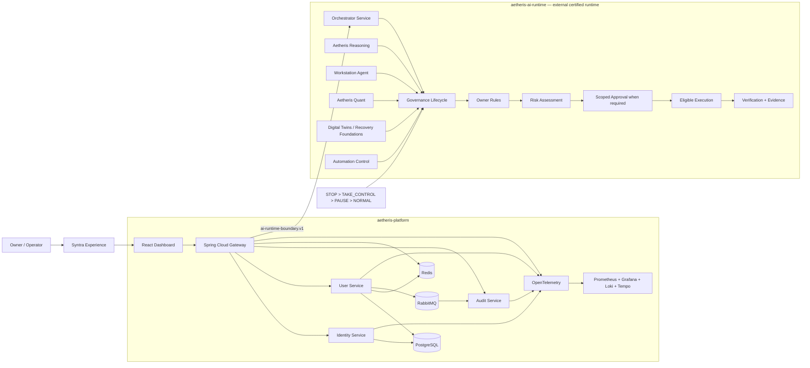

# Aetheris Architecture

This document describes the current architecture after the AI runtime extraction. It preserves the historical 34-stage repository roadmap while making current source ownership explicit.

## 1. System intent

Aetheris is a modular platform plus AI runtime supporting distributed APIs, identity, observability, automation, reasoning, owner policy and evidence-driven execution. Syntra is the owner-facing assistant experience above those layers; models are replaceable reasoning workers rather than policy authority.

The current implementation is split across two repositories:

- **`teldigi5-wq/aetheris-platform`** — gateway, identity, user, audit, dashboard, observability, deployment, cross-repository contracts and integration evidence;
- **`teldigi5-wq/aetheris-ai-runtime`** — orchestrator, workstation-agent, reasoning and quantitative runtime source plus runtime-owned certification.

The platform currently records runtime checkpoint `65a6262717adcd52ac8d8a16ed6f223e299fd74d` as its certified external-runtime reference. A future runtime revision must be recertified before the platform reference advances.

Conceptually the system remains split into three planes:

1. **Experience plane** — dashboard and Syntra-facing interaction surfaces.
2. **Platform plane** — gateway, identity, user, audit, persistence, messaging, observability and the external-runtime integration boundary.
3. **Governance/runtime plane** — orchestration, deterministic owner rules, risk assessment, scoped approvals, execution verification, workstation integration, reasoning and evidence.

## 2. Current topology



The diagram shows a logical system boundary, not duplicate source ownership. Runtime-owned source roots live only in `aetheris-ai-runtime`.

## 3. Component responsibilities and source ownership

| Component | Source owner | Primary responsibility | Important boundary |
|---|---|---|---|
| Dashboard | Platform | Operator/developer UI | Presents platform state; it is not the policy authority |
| API Gateway | Platform | Stable ingress and cross-cutting enforcement | Routes requests and applies trusted boundary controls |
| Identity Service | Platform | Registration, login, refresh and logout/token lifecycle | Credentials and refresh tokens are security-sensitive state |
| User Service | Platform | User-domain logic and persistence | API DTOs remain separated from persistence entities |
| Audit Service | Platform | Consumes/records audit-relevant events | Audit evidence should not be confused with execution authority |
| Orchestrator Service | AI runtime | Coordinates missions, tools, automation and governance foundations | Tool eligibility does not imply successful execution |
| Workstation Agent | AI runtime | Bounded workstation integration foundation | Physical owner-PC validation is still pending |
| Aetheris Reasoning | AI runtime | Reasoning/verification utilities | Models and reasoning workers cannot override deterministic policy |
| Aetheris Quant | AI runtime | Quant/trading proposal foundation | Live-money authority is disabled by policy |
| PostgreSQL | Platform | Durable relational state | Development credentials are not production credentials |
| Redis | Platform | Distributed cache/rate/policy-support state | Availability/failure must not silently weaken authorization |
| RabbitMQ | Platform | Asynchronous event transport | Consumers must treat messages as untrusted until validated |
| Observability stack | Platform | Metrics, traces, logs and dashboards | Telemetry is evidence, not proof of business success by itself |

## 4. Cross-repository integration boundary

The platform consumes the runtime through explicit integration assets instead of carrying a second copy of runtime source:

- `contracts/ai-runtime-boundary.v1.json` — versioned platform/runtime contract;
- `architecture/ai-runtime-certification-reference.json` — currently certified runtime SHA, certification status and truth boundaries;
- `architecture/ai-runtime-extraction-manifest.json` — extraction/source-ownership record;
- `docker-compose.integration-external.yml` — external-runtime integration topology;
- `tools/load_certified_ai_runtime.sh` — helper for loading the certified runtime reference.

The platform certification reference records `65a6262717adcd52ac8d8a16ed6f223e299fd74d` with canonical runtime CI status `6_OF_6_SUCCESS`. It also explicitly records that platform runtime source is absent and that physical-PC, production-deployment, registry-publication and live-money claims remain false.

A runtime update is therefore a controlled dependency/integration change, not a source-copy operation.

## 5. Request and identity flow

The normal service-facing path is:

```text
Client / Dashboard
  → API Gateway
  → authentication / authorization boundary
  → platform service, or external AI-runtime boundary when required
  → persistence / cache / messaging as needed
  → response
  → audit / metrics / traces
```

Identity endpoints are exposed by the identity service under `/api/auth`, including registration, login, refresh and logout flows. Refresh tokens are treated as credentials and are validated/rotated according to the identity implementation.

The gateway is a centralized ingress point, but downstream components should still preserve their own authorization assumptions rather than blindly trusting arbitrary client input.

## 6. Governance and action flow

Aetheris treats AI-generated intent as input to a deterministic action lifecycle:

```text
UNDERSTAND
  → PLAN
  → CHECK RULES
  → ASSESS RISK
  → SIMULATE / PREVIEW when required
  → APPROVE when required
  → EXECUTE
  → VERIFY
  → RECORD
  → LEARN
  → REPORT
```

Key semantics:

- `ALLOW` means the action is **eligible** to execute; it is not proof that it executed.
- If there is no observed execution, the `EXECUTE` phase is incomplete.
- A claimed success requires verification evidence or an explicit `UNVERIFIED` outcome.
- Emergency precedence is deterministic: `STOP > TAKE_CONTROL > PAUSE > NORMAL`.
- Models do not outrank owner rules, Zero-Cost/Private boundaries or emergency control.

## 7. Safety boundaries

The architecture encodes these constraints across the platform/runtime boundary:

- deterministic owner policy is authoritative over model recommendations;
- configured Zero-Cost mode blocks billable/non-zero-cost fallback paths;
- configured Private mode constrains protected data to approved local paths unless exact owner/policy override permits otherwise;
- destructive, privileged, public, financial and difficult-to-undo actions receive stricter handling;
- live-money execution, withdrawals and transfers stay outside the default trusted AI path;
- secrets must not be committed, logged or exposed through prompts/evidence;
- hosted CI cannot prove physical-PC, GPU, microphone, browser, phone or thermal behavior;
- extracted runtime source must not be duplicated back into the platform repository.

## 8. Observability model

The platform Java services emit operational telemetry that can be collected through OpenTelemetry and inspected through the optional observability profile.

```text
Platform services
  → metrics / traces / logs
  → OpenTelemetry / collectors
  → Prometheus + Tempo + Loki
  → Grafana
```

External-runtime behavior has its own runtime-owned proofs and is connected to platform evidence through the versioned boundary and certification reference. A green telemetry dashboard does not replace business-level verification of an action.

## 9. Deployment and integration model

### Core platform local integration

```bash
docker compose up --build
```

The optional observability stack is enabled with:

```bash
docker compose --profile observability up --build
```

### External AI runtime integration

The runtime is not sourced from local platform directories. When an integration run requires orchestration/runtime components, use `docker-compose.integration-external.yml` together with the certified runtime-loading/reference assets.

The currently certified runtime image/evidence reference is recorded in `architecture/ai-runtime-certification-reference.json`. That hosted artifact evidence does **not** imply registry publication.

### Kubernetes

Kubernetes and Helm assets under `deploy/` provide the cloud-native orchestration path. Compose remains useful for local integration while Helm/Kubernetes demonstrate deployment, health and scaling concepts.

## 10. Failure philosophy

Aetheris is designed to prefer explicit failure over silent safety degradation.

Examples:

- invalid input should fail at a trusted boundary;
- dependency failure should be observable and bounded by resilience policy;
- an unavailable or uncertified runtime revision should not silently replace the certified integration reference;
- missing approval should prevent a controlled action from executing;
- missing execution evidence should prevent a success claim;
- unavailable physical hardware should produce `BLOCKED_PENDING_HARDWARE`, not simulated proof of success.

## 11. Repository vs physical-machine truth

The historical repository roadmap is **34 / 34 complete**, and current platform/runtime repository evidence is separately certified.

That status proves repository-side engineering work and hosted CI evidence only. It does not prove the complete system on the owner's target PC. The physical execution phase must separately validate:

- firmware virtualization and WSL2;
- Docker Desktop / container runtime;
- NVIDIA GPU acceleration and local-model performance;
- voice/microphone behavior;
- browser/phone integrations;
- thermals, memory, storage and sustained-load behavior;
- bounded workstation actions and recovery behavior.

Until that evidence exists, physical-machine status remains `BLOCKED_PENDING_HARDWARE`.

There is also no production-activation, registry-publication or live-money execution claim from the current hosted certification state.

## 12. Architectural principles

- owner control before model autonomy;
- evidence before claims;
- explicit service, repository and trust boundaries;
- fail closed for safety-critical decisions;
- reproducible local development;
- observable components and failure behavior;
- no duplicate ownership of extracted runtime source;
- no mandatory recurring AI/platform subscription by design;
- changes should remain explainable in an interview and reviewable in code.

For the canonical cross-system specification, see [`master-build-spec.md`](master-build-spec.md). For major trade-offs and decisions, see [`architecture-decisions.md`](architecture-decisions.md).