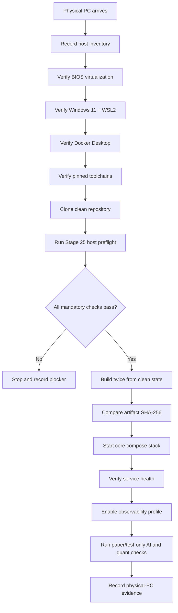

# Aetheris / Syntra First-Boot Runbook

This runbook is prepared before the owner's physical PC arrives. Nothing in this document is evidence that the physical machine has already passed these checks.

## Goal

Turn the first day with the real PC into a controlled validation sequence. Do not redesign the architecture during first boot unless a measured incompatibility forces a change.



## Safety rules

1. Keep `main` stable. Use a checkpoint/branch before any machine-specific fix.
2. Do not expose local APIs directly to the public internet.
3. Do not place real credentials, exchange secrets, passwords, tokens, or JWT secrets in Git.
4. Quant/trading validation remains paper/testnet-only until a separate, explicit owner approval stage.
5. Do not call a check successful merely because it worked in GitHub Actions.
6. If a required check fails, stop at that checkpoint, record the output, fix only the measured problem, and rerun the failed section.
7. Do not lower security controls to make the machine pass the checklist.

## Phase A — Host inventory

Open PowerShell as a normal user first and record:

```powershell
Get-ComputerInfo | Select-Object WindowsProductName, WindowsVersion, OsArchitecture, CsSystemType, CsTotalPhysicalMemory, HyperVisorPresent
Get-CimInstance Win32_Processor | Select-Object Name, NumberOfCores, NumberOfLogicalProcessors
Get-CimInstance Win32_VideoController | Select-Object Name, AdapterRAM, DriverVersion
Get-Volume | Select-Object DriveLetter, FileSystemLabel, Size, SizeRemaining
```

Save the output. This is observation, not a pass/fail by itself.

## Phase B — Virtualization and WSL2

Verify firmware virtualization before changing Windows features. Useful checks:

```powershell
Get-ComputerInfo | Select-Object HyperVisorPresent
systeminfo.exe
wsl --status
wsl --version
wsl -l -v
```

Expected state for the Aetheris local platform:

- hardware virtualization enabled in firmware;
- WSL2 available;
- the selected Linux distribution reports version `2`;
- no virtualization error is ignored or hidden.

If firmware virtualization is disabled, fix it in BIOS/UEFI before attempting Docker Desktop.

## Phase C — Docker Desktop

After WSL2 is healthy:

```powershell
docker --version
docker compose version
docker info
```

`docker info` must succeed against the daemon. Merely having the CLI installed does not count as Docker Desktop working.

Do not start the complete platform yet.

## Phase D — Pinned toolchains

From the repository root, verify the Stage 24 pins:

```powershell
java -version
.\mvnw.cmd -version
node --version
python --version
git --version
```

Expected repository contract:

- Java `21.0.12`
- Maven `3.9.11` through the committed wrapper
- Node `22.23.2`
- Python `3.13.15`

A newer random version is not automatically equivalent. First reproduce the pinned environment; upgrades belong in a reviewed dependency stage.

## Phase E — Run the Stage 25 host preflight

From the repository root:

```powershell
python scripts/first_boot_preflight.py --mode host --evidence-dir build-evidence\physical-pc
```

The host run must be executed on the owner's actual PC. A CI runner, friend PC, cloud VM, or screenshot copied from another machine cannot substitute for this evidence.

The report must show no mandatory failures before continuing.

## Phase F — Clean reproducible build on the real PC

Build from a clean checkout using the committed locks and wrapper. Record hashes after the first build, remove generated build outputs, rebuild, and compare hashes.

The exact commands may be adjusted for PowerShell path syntax, but dependency resolution must remain frozen:

```powershell
.\mvnw.cmd -f gateway\pom.xml clean package
.\mvnw.cmd -f user-service\pom.xml clean package
.\mvnw.cmd -f identity-service\pom.xml clean package
.\mvnw.cmd -f audit-service\pom.xml clean package

Push-Location dashboard
npm ci --ignore-scripts --no-audit --no-fund
npm run build
Pop-Location
```

Do not claim cross-machine reproducibility until the physical-PC hashes have actually been generated and compared with the hosted evidence.

## Phase G — Core service bring-up

Only after the host/build gates pass:

```powershell
docker compose config
docker compose up --build -d postgres redis rabbitmq identity-service user-service audit-service gateway dashboard
```

Then inspect rather than assuming health:

```powershell
docker compose ps
docker compose logs --tail=200 gateway
docker compose logs --tail=200 identity-service
docker compose logs --tail=200 user-service
docker compose logs --tail=200 audit-service
```

Record service-health evidence before enabling optional profiles.

## Phase H — Observability

After the core stack is stable:

```powershell
docker compose --profile observability up -d
```

Verify Prometheus, Tempo, Loki, OpenTelemetry Collector, Alloy, and Grafana individually. A container being `Up` is not sufficient if its application is unhealthy.

## Phase I — AI and quant boundaries

The first physical-PC AI pass is for local model loading, latency/resource measurement, cancellation, fallback and stability. Do not invent benchmark numbers before it happens.

The quant module remains:

- paper trading by default;
- testnet-only for exchange execution validation;
- real-money execution disabled unless a later explicit owner-approved stage enables it with separate risk controls.

## Required evidence before the missing Stage 24 physical-PC points can be earned

The physical-PC evidence pack must contain, at minimum:

- `host-inventory.json`
- `virtualization-status.txt`
- `wsl-status.txt`
- `docker-info.txt`
- `toolchain-versions.txt`
- first and second build SHA-256 manifests
- service-health evidence
- observability-health evidence

A failure remains a failure in the evidence pack. Do not delete or rewrite failed logs merely to make the record look clean; add the successful rerun beside them.

## Completion rule

Stage 25 preparation can be completed before the PC arrives. **Physical-PC validation cannot.** When the machine arrives, this runbook becomes the acceptance procedure for the hardware-dependent portion of the roadmap.
